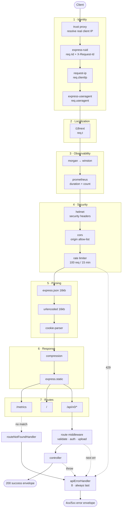
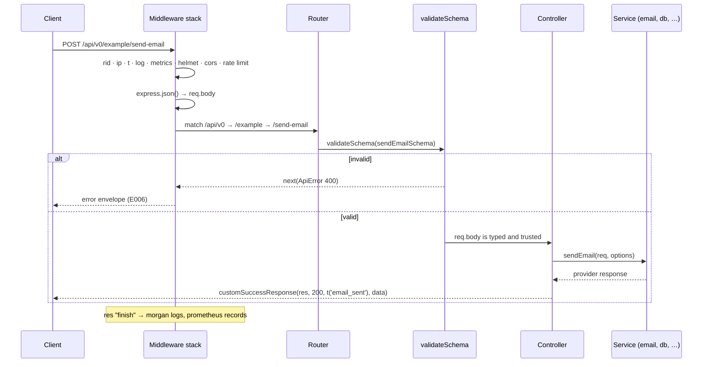
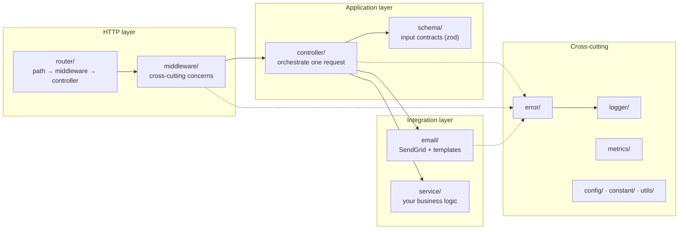

# 02 · Architecture

## The one idea you must understand

An Express application is **an ordered list of functions**. Each one receives
`(req, res, next)`, and each either responds or calls `next()` to pass control
along. That is the whole model.

```ts
app.use(helmet()); // runs 1st
app.use(rateLimiter); // runs 2nd
app.use(express.json()); // runs 3rd
```

Two consequences follow, and almost every Express bug comes from missing one:

1. **Order is behaviour.** Moving a line in `src/app.ts` changes what the server
   does. Registering the body parser after your routes means `req.body` is
   `undefined` inside them.
2. **The first function to respond ends the request.** If the rate limiter
   answers with 429, nothing after it runs.

So `src/app.ts` is not configuration — it is the architecture, written top to
bottom.

## The pipeline



## Why each group sits where it does

| #   | Group          | Must run before…     | What breaks if you move it later                                                                                                |
| --- | -------------- | -------------------- | ------------------------------------------------------------------------------------------------------------------------------- |
| 1   | Identity       | everything           | Logs and errors lose the request id; `req.clientIp` is undefined, so rate limiting keys on nothing                              |
| 2   | i18n           | anything user-facing | `req.t` is undefined — the rate limiter and error handler crash while trying to build a message                                 |
| 3   | Observability  | security             | Rejected requests vanish from logs and metrics. **A rate-limit spike would be invisible** — exactly the traffic you need to see |
| 4   | Security       | parsing              | The server parses a 16kb body for a request it was going to reject anyway. Free work for an attacker                            |
| 5   | Parsing        | routes               | `req.body` is `undefined` in every controller                                                                                   |
| 6   | Response       | routes               | `compression` never sees the response it is supposed to compress                                                                |
| 7   | Routes         | error handling       | —                                                                                                                               |
| 8   | Error handling | nothing — it is last | Errors fall through to Express' default handler, which returns an HTML stack trace                                              |

> ⚠️ Observability sitting _before_ security is the one placement people
> instinctively get wrong. Security first "feels" right, but then your
> dashboards only show traffic that already passed the gate.

## A successful request, end to end



## Layers and responsibilities



**The rule that keeps this honest: dependencies point downward.** A controller
may call a service; a service must never import a controller. If you find
yourself wanting to, the logic belongs in a third module both can use.

### What belongs in each layer

| Layer          | Does                                                      | Never does                                        |
| -------------- | --------------------------------------------------------- | ------------------------------------------------- |
| **Router**     | Declares path + middleware chain                          | Contains logic, touches `req.body`                |
| **Middleware** | One cross-cutting concern, applied to many routes         | Knows about a specific feature                    |
| **Controller** | Reads validated input, calls services, sends one response | Talks to SendGrid/DB directly, re-validates input |
| **Service**    | Business logic and I/O, reusable                          | Touches `res`, knows about HTTP status codes      |
| **Schema**     | Declares the input contract, infers the types             | Contains business rules that need a database      |

## Contracts

Every response in this application has one of exactly two shapes. Clients can
be written against them without reading endpoint-specific docs.

**Success** — `src/utils/customSuccessResponse.ts`

```json
{ "success": true, "status": 200, "message": "Human readable, translated", "data": {} }
```

**Error** — `src/error/apiErrorFormat.ts`

```json
{
    "success": false,
    "status": "error",
    "statusCode": 400,
    "error": {
        "errorId": "a3f1…",
        "requestId": "host/abc-0000000000000003",
        "name": "ApiError",
        "code": "E006",
        "message": "Schema validation error.",
        "details": "body.to: Invalid email",
        "suggestion": "Please correct the highlighted fields and try again.",
        "ip": "::1",
        "url": "/api/v0/example/send-email",
        "method": "POST",
        "timestamp": "2026-09-26T13:12:07.225Z"
    }
}
```

`errorId` appears in the response _and_ in the logs — that is what turns a
screenshot from a user into a single `grep`. See
[07-error-handling.md](07-error-handling.md).

## Request lifecycle guarantees

By the time a controller runs, these are always true:

- `req.rid` — unique id, echoed to the client as `X-Request-Id`
- `req.clientIp` — the real client IP, provided `TRUST_PROXY` is set correctly
- `req.t(key, { ns })` — translation function for this request's language
- `req.body` / `req.query` / `req.params` — parsed, and **validated + coerced**
  if the route uses `validateSchema`
- Any error you throw reaches `apiErrorHandler` — async included, thanks to
  `asyncCatch`

## Design principles this codebase follows

| Principle                  | Where you can see it                                                                                  |
| -------------------------- | ----------------------------------------------------------------------------------------------------- |
| **Fail fast**              | Invalid env config exits at boot (`src/config/env.ts`) rather than failing on request #4,000          |
| **Single responsibility**  | One middleware = one concern. `verifyApiKey` does not log, `morgan` does not authenticate             |
| **Don't repeat yourself**  | One error envelope, one success envelope, one place that maps third-party errors                      |
| **YAGNI**                  | No database abstraction, no DI container, no plugin system — add them when a real requirement arrives |
| **Least privilege**        | Docker runs as `node`, `/metrics` can require a key, CORS is an allow-list                            |
| **Explicit over implicit** | Config is validated and typed; nothing reads `process.env` outside `src/config/env.ts`                |

## Next

- Where files live → [03-project-structure.md](03-project-structure.md)
- Add an endpoint → [05-routing-and-controllers.md](05-routing-and-controllers.md)
