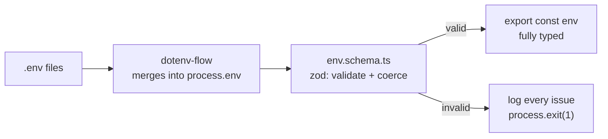

# 04 · Configuration

## The rule

> **Exactly one module reads `process.env`: `src/config/env.ts`.**
> Everything else imports the typed `env` object it exports.

```ts
import { env } from '@/config/env';

if (env.app.NODE_ENV === 'development') {
    /* … */
}
app.set('trust proxy', env.app.TRUST_PROXY); // already a boolean | number
```

Why that matters:

| Reading `process.env` everywhere                  | Reading a validated `env`                   |
| ------------------------------------------------- | ------------------------------------------- |
| Every value is `string \| undefined`              | Real types: `number`, `boolean`, `string[]` |
| A typo (`PROCESS.env.PORT`) is `undefined` at 3am | A typo is a compile error                   |
| Missing variables surface on request #4,000       | Missing variables stop the boot             |
| No single list of what the app needs              | The schema _is_ the list                    |

## How it works



`src/config/env.ts` is ~50 lines and does exactly this. Read it — it is the
shortest file worth reading in the repo.

## File loading order

`dotenv-flow` merges several files, **later ones overriding earlier**:

```
.env                      committed defaults (this repo has none)
.env.local                your machine        ← gitignored
.env.development          shared dev defaults
.env.development.local    your dev overrides  ← gitignored
```

With `NODE_ENV=production` the same pattern uses `.env.production`.

| Environment       | What to use                                          |
| ----------------- | ---------------------------------------------------- |
| Local development | `.env.local`                                         |
| Docker Compose    | `.env.production` (referenced by `env_file:`)        |
| A real server     | Real environment variables, injected by the platform |

> ⚠️ In production, prefer **injected environment variables** (ECS task
> definitions, Kubernetes secrets, systemd `EnvironmentFile`) over a `.env` file
> on disk. A file can be read by any process that gets a shell on the box, and
> ends up in backups and images.

## The variables

Required — the server will not start without them:

| Variable     | Type                                | Notes                                                    |
| ------------ | ----------------------------------- | -------------------------------------------------------- |
| `NODE_ENV`   | `development \| production \| test` | Drives log format, stack traces, dev escape hatches      |
| `CLIENT_URL` | URL list                            | CORS allow-list. Comma-separate for several origins      |
| `API_KEY`    | string, ≥ 16 chars                  | Shared secret for `verifyApiKey`. `openssl rand -hex 32` |

Optional — defaults in brackets:

| Variable                                  | Default               | Notes                                                                 |
| ----------------------------------------- | --------------------- | --------------------------------------------------------------------- |
| `PORT`                                    | `8080`                |                                                                       |
| `LOG_LEVEL`                               | `dev`                 | Morgan format: `dev`, `short`, `combined`, `common`, `tiny`           |
| `TRUST_PROXY`                             | `false`               | **Read [09-security.md](09-security.md#trust-proxy) before changing** |
| `DISABLE_RATE_LIMITER`                    | `false`               | Local load testing only                                               |
| `DISABLE_VALIDATE_API_KEY_ON_DEVELOPMENT` | `false`               | Only honoured when `NODE_ENV=development`                             |
| `PROTECT_METRICS`                         | `false`               | Require `x-api-key` on `/metrics`                                     |
| `ENABLE_API_DOCS`                         | on outside production | Serve the interactive reference at `/docs`                            |
| `SEND_GRID_API_KEY`                       | —                     | Optional integration                                                  |
| `SEND_GRID_FROM_EMAIL`                    | —                     | Optional integration                                                  |

## Blank is not a value

```ini
SEND_GRID_API_KEY=
```

That is the **empty string**, not `undefined`. An optional variable left blank
is therefore "present but invalid" and fails validation — which is exactly what
a blank `SEND_GRID_API_KEY=` in `.env.example` used to do: it stopped the server
booting even though SendGrid is optional.

Every variable is read through one helper, so the rule holds everywhere:

```ts
const read = (value: string | undefined): string | undefined => {
    const trimmed = value?.trim();
    return trimmed === '' ? undefined : trimmed;
};
```

Blank means unset. Trimming also removes the trailing whitespace that otherwise
makes a pasted `API_KEY` silently fail to match.

## Coercion: the part people get wrong

Environment variables are **always strings**. `"false"` is a non-empty string,
so this is a bug that looks correct:

```ts
if (process.env.DISABLE_RATE_LIMITER) {
    /* runs even when the value is "false" */
}
```

The schema converts once, at the edge, so the rest of the codebase never repeats
the mistake:

```ts
const booleanFromString = (defaultValue: boolean) =>
    z
        .string()
        .optional()
        .transform((v) => (v === undefined ? defaultValue : TRUTHY_VALUES.includes(v.trim().toLowerCase())));
```

`'true' | 't' | '1' | 'yes' | 'y'` (case-insensitive) mean true. Everything else,
including absence, means false.

The same pattern turns `PORT` into a number, `CLIENT_URL` into a validated
`string[]`, and `TRUST_PROXY` into `boolean | number | string`.

## Required vs optional integrations

`NODE_ENV`, `CLIENT_URL` and `API_KEY` are required because **no request can be
served correctly without them** — fail fast at boot.

SendGrid is optional because a fork that never sends email should not have to
invent credentials to start the server. It fails at _call_ time instead, with a
503 and an actionable message:

```ts
if (!env.sendgrid.isConfigured) {
    throw new ApiError(503, 'E009', t('email_not_configured_message', { ns: 'error' }), …);
}
```

> 💡 The heuristic: **required if the server is broken without it, optional if
> one feature is.** Optional must still fail loudly when used — never silently
> no-op.

## Adding a variable

Four files, in this order:

**1. Declare it** — `src/schema/env.schema.ts`

```ts
app: z.object({
    // …
    REQUEST_TIMEOUT_MS: z.string().optional().default('30000')
        .transform(Number).pipe(z.number().int().positive()),
}),
```

**2. Wire it** — `src/config/env.ts`

```ts
app: {
    // …
    REQUEST_TIMEOUT_MS: process.env.REQUEST_TIMEOUT_MS,
},
```

**3. Document it** — `.env.example`, with a comment explaining what changes and
what a safe value looks like. This file is how the next developer discovers it.

**4. Use it** — `env.app.REQUEST_TIMEOUT_MS`, already a `number`.

### Adding a new integration group

```ts
export const envSchema = z.object({
    app: z.object({/* … */}),

    database: z.object({
        DATABASE_URL: z.string().url(),
        DATABASE_POOL_SIZE: z.string().optional().default('10').transform(Number),
    }),
});
```

Use a flat required group like this when the feature is essential (a database
usually is). Use the `.partial()` + `isConfigured` pattern from `sendgrid` when
it is not.

## What a failed boot looks like

```
[2026-09-26 18:42:11] error: Invalid environment configuration:
  - app.CLIENT_URL: CLIENT_URL must contain valid URLs
  - app.API_KEY: API_KEY must be at least 16 characters

Check .env.example and your .env.local file.
```

Every problem is reported at once, not one per restart. That is deliberate: a
schema collects all issues before it reports.

## Secrets

- ✅ `.env.example` with placeholder values is committed
- ❌ `.env`, `.env.local`, `.env.production` are gitignored and must stay that way
- ❌ Never log `env` — `logger.info(env)` prints your API key into a file, and
  from there into your log aggregator
- ⚠️ Docker: `.dockerignore` excludes every `.env*` file except the example, so
  secrets never end up baked into an image layer
- 🔁 Rotate `API_KEY` by supporting two keys briefly, then removing the old one

If a secret ever reaches a commit, **rotate it**. Rewriting git history does not
help — it was already pushed, cloned, and cached.
