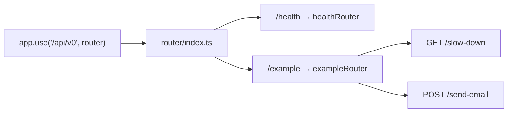

# 05 · Routing and Controllers

## Three files per feature

```
src/schema/user.schema.ts     what the endpoint accepts   (contract + types)
src/controller/user.ts        what the endpoint does      (orchestration)
src/router/user.route.ts      how it is reached           (path + guards)
```

Splitting them is not ceremony. It means you can read the security posture of
every endpoint in one small file without wading through business logic, and it
means the contract is a _thing_ — importable, inspectable, and the source of
your types.

## Router composition



The final URL is the concatenation of every mount point:

```
app.use('/api/v0', router)            →  /api/v0
router.use('/example', exampleRouter) →  /api/v0/example
exampleRouter.get('/api-key', …)      →  /api/v0/example/api-key
```

### Why the version lives in the mount path

```ts
app.use('/api/v0', router);
```

When a breaking change is unavoidable, you mount `/api/v1` beside `/api/v0` and
run both until clients migrate. Versioning at the top means no route file
changes to make that happen.

> 💡 Only break for genuinely breaking changes: removing a field, renaming one,
> changing a type, or tightening validation. Adding an optional field is not
> breaking — do not spend a version number on it.

### Adding a feature router

```ts
// src/router/index.ts
import { userRouter } from '@/router/user.route';

router.use('/users', userRouter);
```

## Routers stay thin

```ts
const exampleRouter = Router();

exampleRouter.post('/send-email', validateSchema(sendEmailSchema), sendEmailExample);
exampleRouter.post('/file-upload', uploadExampleFile.single('example_file'), fileUploadExample);
exampleRouter.get('/api-key', verifyApiKey, exampleVerifyApiKey);
```

Path, guards, handler. Nothing else. Middleware runs left to right, so **order
the chain cheapest-rejection-first**:

```ts
router.post('/x', verifyApiKey, validateSchema(schema), upload.single('f'), handler);
//               ↑ reject unauthenticated before parsing or buffering anything
```

## The controller

```ts
export const sendEmailExample = asyncCatch(async (req: Request<{}, {}, sendEmailType['body'], {}>, res: Response) => {
    const t = req.t;
    const payload = req.body; // already validated and typed

    const [emailResponse] = await sendEmail(req, {
        to: payload.to,
        subject: 'Express Template',
        templatePath: 'public/welcome.template.html',
        dynamicData: { name: payload.dynamicTemplateData.name, year: new Date().getFullYear() },
    });

    customSuccessResponse(res, 200, t('email_sent'), emailResponse);
});
```

Five rules, and the template follows all of them:

1. **Wrap in `asyncCatch`** — without it, a rejected promise hangs the request
2. **Trust the input** — validation already happened; no defensive re-checks
3. **Delegate the work** — the controller calls `sendEmail`, it does not talk to SendGrid
4. **Respond once** — exactly one `customSuccessResponse` or one `throw`
5. **Translate user-facing text** — `t('email_sent')`, never a literal string

### `asyncCatch`: why it exists

Express 4 does not understand promises. This handler hangs forever — the client
waits until it times out, and nothing is logged:

```ts
router.get('/x', async (req, res) => {
    const data = await mightReject(); // ❌ rejection is unhandled
    res.json(data);
});
```

`asyncCatch` attaches the missing `.catch(next)`:

```ts
export default function asyncCatch(fn) {
    return (req, res, next) => {
        Promise.resolve(fn(req, res, next)).catch(next);
    };
}
```

⚠️ **Every async handler and async middleware must be wrapped.** It is the
single most common source of mysterious hanging requests in an Express codebase.

### Typing a request

```ts
Request<Params, ResBody, ReqBody, ReqQuery>;
```

```ts
// body only
async (req: Request<{}, {}, sendEmailType['body'], {}>, res: Response) => …

// query only
async (req: Request<{}, {}, {}, metricsType['query']>, res: Response) => …

// route params
async (req: Request<{ id: string }>, res: Response) => …
```

Pull the types from the schema with `z.infer` rather than writing them twice —
see [06-validation.md](06-validation.md).

## Responding

```ts
customSuccessResponse(res, 200, t('welcome'), { appName, appVersion });
```

```json
{ "success": true, "status": 200, "message": "Welcome to the API", "data": {} }
```

Never call `res.json()` directly in a controller. One envelope for every
endpoint is what lets a client write one response handler instead of twenty.

| Status | Use for                                               |
| ------ | ----------------------------------------------------- |
| 200    | Successful GET, PUT, PATCH, DELETE                    |
| 201    | Created a resource (return it, or its location)       |
| 202    | Accepted for async processing                         |
| 204    | Success with nothing to return (no envelope, no body) |

To fail, **throw** — never return an error envelope by hand:

```ts
throw new ApiError(
    STATUS_CODES.NOT_FOUND,
    ERROR_CODES.NOT_FOUND,
    t('file_not_found_message', { ns: 'error' }),
    t('file_not_found_details', { ns: 'error' }),
    t('file_not_found_suggestion', { ns: 'error' }),
);
```

## Common mistakes

| Mistake                               | Symptom                                 | Fix                                                 |
| ------------------------------------- | --------------------------------------- | --------------------------------------------------- |
| Missing `asyncCatch`                  | Request hangs, no logs                  | Wrap the handler                                    |
| `res.json()` after `next(err)`        | `ERR_HTTP_HEADERS_SENT` crash           | One response per request; `return` after responding |
| Business logic in the router          | Untestable, unreadable security posture | Move it to a controller or service                  |
| Validating inside the controller      | Duplicated, drifts from the schema      | Use `validateSchema`                                |
| Hard-coded English strings            | Broken i18n                             | `req.t('key')`                                      |
| `/api/v0/getUsers`                    | Verb in the URL                         | `GET /api/v0/users` — the method is the verb        |
| Forgetting `router.use` in `index.ts` | Every route 404s                        | Mount the router                                    |

## Next

- The validation layer → [06-validation.md](06-validation.md)
- A complete worked feature → [17-extending.md](17-extending.md)
