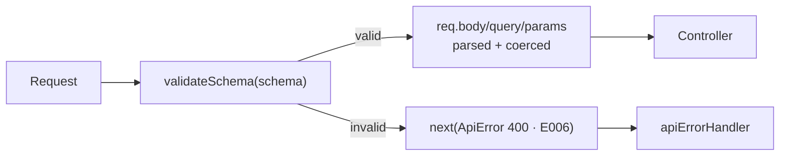

# 06 · Validation

## Why validate at the edge

Every field that arrives over HTTP is attacker-controlled. Not "might be" —
**is**, because a client is just a program someone else controls.

Validating once, at the boundary, buys three things at the same time:

1. **Security** — malformed and malicious input never reaches your logic
2. **Types you can trust** — the compiler's view matches runtime reality
3. **Clean controllers** — no `if (!req.body.email) return res.status(400)` noise

The alternative — checking as you go — means the same rule lives in five places
and disagrees with itself within a month.

## One line per route

```ts
exampleRouter.post('/send-email', validateSchema(sendEmailSchema), sendEmailExample);
```



## Writing a schema

A schema describes the **request parts it cares about** — `body`, `query`,
`params`, `headers` — and nothing else:

```ts
// src/schema/example.schema.ts
export const sendEmailSchema = z.object({
    body: z.object({
        to: z.string({ required_error: 'to (receiver) is required' }).email(),
        dynamicTemplateData: z.object({
            name: z.string().min(1),
            role: z.string().min(1),
        }),
    }),
});

export type sendEmailType = z.infer<typeof sendEmailSchema>;
```

Then in the controller:

```ts
async (req: Request<{}, {}, sendEmailType['body'], {}>, res: Response) => {
    req.body.dynamicTemplateData.name; // string, guaranteed
};
```

**`z.infer` is the whole point.** The runtime check and the compile-time type
come from one declaration, so they cannot drift. Change the schema and
TypeScript shows you every call site that needs updating.

## Coercion

Query strings and headers are always strings. `z.coerce` converts before
validating, so the controller receives what its type promises:

```ts
export const metricsSchema = z.object({
    query: z.object({
        loop: z.coerce.number().int().nonnegative().max(60).default(0),
    }),
});
```

```
GET /api/v0/example/metrics?loop=5   →  req.query.loop === 5      (number)
GET /api/v0/example/metrics          →  req.query.loop === 0      (default)
GET /api/v0/example/metrics?loop=abc →  400, "query.loop: Expected number"
GET /api/v0/example/metrics?loop=999 →  400, "query.loop: … less than or equal to 60"
```

That `.max(60)` is not cosmetic: the endpoint sleeps one second per loop, so an
unbounded value is a free denial-of-service. **Bound every numeric input that
costs the server something** — page sizes, limits, retry counts, date ranges.

## How the middleware works

`src/middleware/schema.validation.ts`, in full:

1. `schema.safeParse({ body, query, params, headers })` — no exception on failure
2. On failure → `next(new ApiError(400, 'E006', …))` with every issue in `details`
3. On success → copy back **only the parts the schema declared**

That last step is subtle and was a real bug in this template:

```ts
// ❌ what looks obvious
const parsed = schema.parse({ body, query, params, headers });
req.body = parsed.body;
req.query = parsed.query; // undefined for a body-only schema!
req.headers = parsed.headers; // undefined → breaks every later middleware
```

Zod **strips** keys a schema does not declare, so `parsed.query` simply does not
exist for a body-only schema. Assigning it blindly wipes `req.headers`. The fix:

```ts
for (const part of REQUEST_PARTS) {
    if (parsed[part] !== undefined) Object.assign(req, { [part]: parsed[part] });
}
```

## The error response

```json
{
    "success": false,
    "statusCode": 400,
    "error": {
        "code": "E006",
        "message": "Schema validation error.",
        "details": "body.to: Invalid email; body.dynamicTemplateData: Required",
        "suggestion": "Please correct the highlighted fields and try again."
    }
}
```

`details` lists **every** failing field — one round trip tells the client
everything that is wrong, instead of one problem per attempt.

## Patterns worth knowing

**Route params are strings**

```ts
export const getUserSchema = z.object({
    params: z.object({ id: z.string().uuid() }),
});
```

**Pagination with sane bounds**

```ts
query: z.object({
    page: z.coerce.number().int().positive().default(1),
    limit: z.coerce.number().int().positive().max(100).default(20),
});
```

**Reject unknown fields** (default is to strip them silently)

```ts
body: z.object({ name: z.string() }).strict();
```

Use `.strict()` when silently ignoring a typo would be worse than rejecting it —
`{ "amout": 100 }` should fail loudly, not transfer zero.

**Cross-field rules**

```ts
body: z.object({
    startDate: z.coerce.date(),
    endDate: z.coerce.date(),
}).refine((d) => d.endDate > d.startDate, {
    message: 'endDate must be after startDate',
    path: ['endDate'],
});
```

**Reuse**

```ts
const email = z.string().email().toLowerCase().trim();
const password = z.string().min(12, 'Use at least 12 characters');

export const signupSchema = z.object({ body: z.object({ email, password }) });
export const loginSchema = z.object({ body: z.object({ email, password }) });
```

**Normalise while validating** — `.trim()`, `.toLowerCase()`, `.transform()` run
during parsing, so the controller receives clean data. `"  Bob@Example.COM "`
becomes `"bob@example.com"` before anything else touches it.

## What validation does _not_ do

| Concern                             | Belongs in                                               |
| ----------------------------------- | -------------------------------------------------------- |
| "Is this email already registered?" | A service — it needs the database                        |
| "Can this user edit this record?"   | Authorization middleware or the service                  |
| "Is this file actually a PNG?"      | Magic-byte check after upload ([14](14-file-uploads.md)) |

A schema answers _"is this well-formed?"_, not _"is this allowed?"_.

## Common mistakes

| Mistake                               | Consequence                                        |
| ------------------------------------- | -------------------------------------------------- |
| Validating in the controller          | The rule drifts from the declared contract         |
| Hand-writing the TypeScript type      | Type and runtime check disagree silently           |
| `z.any()` for convenience             | No validation at all, with a false sense of safety |
| Unbounded `limit`/`loop`              | `?limit=1000000` becomes a DoS                     |
| Trusting `Content-Type` or `mimetype` | Both are client-supplied strings                   |
| Validating only `body` on a GET       | Query parameters are just as attacker-controlled   |
