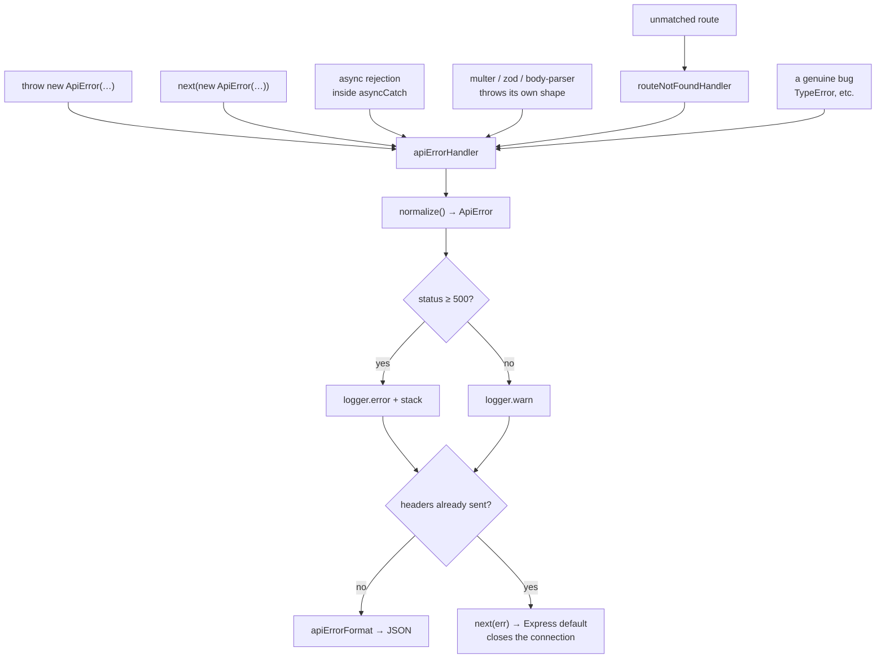

# 07 · Error Handling

## The contract

Every failure in this API — a bad email, a missing route, a dead database —
produces the same JSON shape. Clients write one error handler. Support has one
place to look. Nothing leaks.

```json
{
    "success": false,
    "status": "error",
    "statusCode": 400,
    "error": {
        "errorId": "92f87c41-9d36-4eb6-88dc-5c8bb57c3cf3",
        "requestId": "host/5bc1e92c-0000000000000007",
        "name": "ApiError",
        "code": "E006",
        "message": "Schema validation error.",
        "details": "body.to: Invalid email",
        "suggestion": "Please correct the highlighted fields and try again.",
        "ip": "::1",
        "url": "/api/v0/example/send-email",
        "method": "POST",
        "timestamp": "2026-09-26T13:12:07.225Z"
    }
}
```

### Why three message fields

Most APIs return one string and leave the client guessing.

| Field        | Answers        | Example                                               |
| ------------ | -------------- | ----------------------------------------------------- |
| `message`    | What happened? | "File too large."                                     |
| `details`    | Why?           | "The uploaded file exceeds the maximum allowed size." |
| `suggestion` | What now?      | "Please upload a smaller file and try again."         |

A client can show `message` in a toast and `suggestion` under the form field —
without inventing copy the backend already knows.

### `errorId` and `requestId`

- **`errorId`** — unique to this failure, returned to the client **and** written
  to the logs. A user's screenshot becomes `grep 92f87c41 logs/error.log`.
- **`requestId`** — from `express-ruid`, also returned as the `Request-Id`
  header, and present on every log line for that request. It ties the failure to
  everything that happened before it.

## The flow



## `ApiError`

The only error this application throws on purpose:

```ts
throw new ApiError(
    STATUS_CODES.NOT_FOUND, // HTTP status
    ERROR_CODES.NOT_FOUND, // stable code: 'E005'
    t('file_not_found_message', { ns: 'error' }), // message
    t('file_not_found_details', { ns: 'error' }), // details
    t('file_not_found_suggestion', { ns: 'error' }), // suggestion
);
```

### Operational vs programmer errors

`ApiError` carries `isOperational` (default `true`):

|             | Operational                                           | Programmer                             |
| ----------- | ----------------------------------------------------- | -------------------------------------- |
| Examples    | Bad input, missing auth, rate limit, third-party down | `undefined is not a function`, bad SQL |
| Expected?   | Yes — normal traffic                                  | No — a bug                             |
| Client sees | The real message                                      | A generic message                      |
| You should  | Handle it                                             | Fix it, and alert on it                |

`normalize()` creates non-operational `ApiError`s for anything unrecognised, so
an unexpected `TypeError` returns "An error occurred." and keeps its real stack
in the logs only.

### Status and error codes

HTTP status is too coarse for a client to branch on — a 400 could be a bad
email, an oversized file, or malformed JSON. The `E0xx` code is stable and
machine-readable; the message is free to be reworded or translated.

| Code   | Status | Meaning                                      |
| ------ | ------ | -------------------------------------------- |
| `E000` | 429    | Rate limit exceeded                          |
| `E001` | 500    | Unexpected failure                           |
| `E002` | 400    | Invalid JSON config _(legacy — prefer E006)_ |
| `E003` | 404    | Route not found                              |
| `E004` | 401    | Unauthorized                                 |
| `E005` | 404    | Resource not found                           |
| `E006` | 400    | Validation error                             |
| `E007` | 413    | Payload too large                            |
| `E008` | 415    | Unsupported media type                       |
| `E009` | 503    | Dependency unavailable                       |
| `E010` | 403    | Forbidden                                    |

> Never reuse a code for a different meaning. Clients branch on them; changing
> one is a breaking change. Add a new code instead.

## Normalising third-party errors

Multer, Zod and body-parser each throw their own shape. `normalize()` maps them
before anything reaches the client, so no library's English-only message ever
leaks into a translated API:

| Source                            | Becomes                                        |
| --------------------------------- | ---------------------------------------------- |
| `MulterError('LIMIT_FILE_SIZE')`  | 413 · `E007` · "File too large."               |
| `MulterError('LIMIT_FILE_COUNT')` | 400 · `E006` · "Too many files."               |
| `ZodError`                        | 400 · `E006` · each issue in `details`         |
| `type: 'entity.parse.failed'`     | 400 · `E006` · "Malformed JSON body."          |
| `type: 'entity.too.large'`        | 413 · `E007` · "Request body too large."       |
| anything else                     | 500 · `E001` · generic, `isOperational: false` |

Adding a case is a few lines in `normalize()` — that is the extension point when
you add a database or an HTTP client with its own error types.

## Three rules the handler follows

**1. Four parameters, or it is not an error handler.**

```ts
export function apiErrorHandler(err, req, res, next) {} // ✅ error handler
export function apiErrorHandler(err, req, res) {} // ❌ ordinary middleware
```

Express identifies error handlers _by arity_. Drop `next` and yours silently
stops running — one of the hardest Express bugs to spot.

**2. Registered last.**

```ts
app.use(routeNotFoundHandler);
app.use(apiErrorHandler); // after every route
```

**3. Respond once.** If the response already started, there is no status line
left to set; only Express' default handler can close the connection correctly:

```ts
if (res.headersSent) return next(err);
```

⚠️ Do **not** call `next()` after sending a response. The previous version of
this file did, which risked `ERR_HTTP_HEADERS_SENT` the moment anything was
registered after it.

## Stack traces

```ts
stack: isDevelopment ? error.stack : undefined;
```

A stack trace tells an attacker your directory layout, dependency versions and
internal call structure. Locally it is essential; in production it belongs in
the logs, reachable via `errorId`.

## Logging policy

```ts
if (error.statusCode >= 500) logger.error(message, payload);
else logger.warn(message, payload);
```

- **5xx = we broke.** Alert on these.
- **4xx = the caller sent something wrong.** Normal traffic; a spike is
  interesting, an individual one is not.

Alerting on 4xx is how on-call rotations burn out.

Each error is logged **exactly once**, by this handler, with full context. Do
not also log where you throw — duplicated lines make incidents harder, not
easier.

## Async errors

```ts
export const handler = asyncCatch(async (req, res) => {
    const user = await db.findUser(id);          // rejects → apiErrorHandler
    if (!user) throw new ApiError(404, 'E005', …); // throws → apiErrorHandler
    customSuccessResponse(res, 200, req.t('ok'), user);
});
```

Without `asyncCatch`, a rejection is unhandled: the request hangs until the
client times out and nothing is logged. **Wrap every async handler.**

## Throwing errors well

```ts
// ❌ no status, no code, no translation, leaks internals
throw new Error('User 4f3a not found in shard 7');

// ✅
throw new ApiError(
    STATUS_CODES.NOT_FOUND,
    ERROR_CODES.NOT_FOUND,
    t('user_not_found_message', { ns: 'error' }),
    t('user_not_found_details', { ns: 'error' }),
    t('user_not_found_suggestion', { ns: 'error' }),
);
logger.warn('User lookup failed', { userId, shard }); // internals → logs only
```

### Never swallow an error

```ts
try {
    await sendEmail(req, options);
} catch {
    /* ignore */
} // ❌
```

The request returns 200, the user never gets the email, and nothing is recorded.
If a failure is genuinely non-fatal, **log it and say so**:

```ts
try {
    await sendEmail(req, options);
} catch (error) {
    logger.error('Welcome email failed; signup continues', { error, userId });
}
```

## Process-level failures

`src/server.ts` handles what no request handler can reach:

```ts
process.on('unhandledRejection', …);   // log, then shut down gracefully
process.on('uncaughtException',  …);   // log, then shut down gracefully
```

After an uncaught exception the process is in an **unknown state** — a
half-finished write, a dangling transaction. Continuing to serve traffic is
worse than restarting. Log it, close cleanly, and let PM2/Docker/Kubernetes
start a healthy process. See [15-deployment.md](15-deployment.md).
