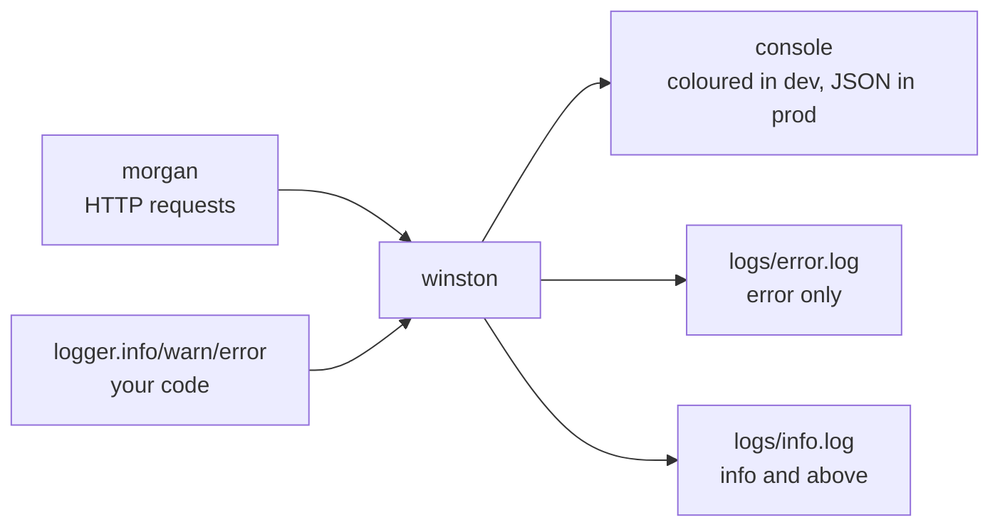

# 08 · Logging

## Two loggers, one pipeline

| Logger      | Records                   | File                           |
| ----------- | ------------------------- | ------------------------------ |
| **Winston** | Everything your code logs | `src/logger/winston.logger.ts` |
| **Morgan**  | One line per HTTP request | `src/logger/morgan.logger.ts`  |

Morgan does not print anything itself — it writes into Winston's `http` level:

```ts
const stream = { write: (message: string) => logger.http(message.trim()) };
```

So there is **one** pipeline, one format, one set of destinations. Without this,
request logs go to stdout in one format while application logs go to files in
another, and correlating them during an incident is manual work.



## Levels

```ts
const levels = { error: 0, warn: 1, info: 2, http: 3, debug: 4 };
```

A transport set to `info` records `error`, `warn` and `info` — **lower number
means higher severity**.

| Level   | Use for                             | Example                                 |
| ------- | ----------------------------------- | --------------------------------------- |
| `error` | Something broke and needs attention | Unhandled exception, failed email       |
| `warn`  | Wrong but handled                   | 4xx responses, deprecated endpoint used |
| `info`  | Significant lifecycle events        | Server started, shutdown, i18n ready    |
| `http`  | Request logs (Morgan)               | `GET /api/v0/health 200 1.2ms`          |
| `debug` | Development detail                  | Payload dumps while chasing a bug       |

The active level is environment-driven: `debug` in development, `info` in
production. Debug lines cost nothing in production — they are filtered before
formatting.

> ⚠️ `no-console` is an ESLint **error** in this repo. `console.log` is
> unlevelled, unstructured, unfiltered and invisible to log shippers. Use the
> logger.

## Structured logging

Pass context as an object, never by string concatenation:

```ts
// ❌ unsearchable
logger.error(`Failed to send email to ${email} for user ${userId}`);

// ✅ queryable
logger.error('Failed to send email', { email, userId, provider: 'sendgrid' });
```

Files are written as JSON, so every field is indexable in Loki, CloudWatch or
Datadog. `{userId="123"}` beats a regex over free text, and the fields survive
message rewording.

The error handler is the model to copy:

```ts
logger.error(error.message, {
    errorId,
    requestId: req.rid,
    code: error.errorCode,
    statusCode: error.statusCode,
    method: req.method,
    url: req.originalUrl,
    ip: req.clientIp,
    stack: error.stack,
});
```

## Correlation

`express-ruid` assigns every request an id, returns it as `Request-Id`, and
makes it available as `req.rid`. Include it whenever you log inside a request:

```ts
logger.info('Payment captured', { requestId: req.rid, orderId, amount });
```

One id then ties together: the Morgan access line, every application log, the
error log entry, and the `errorId` the client was shown.

> 💡 Passing `req.rid` by hand is repetitive. If your app grows, look at
> `AsyncLocalStorage` (Node's built-in request context) or `winston`'s child
> loggers to attach it automatically.

## Output by environment

**Development** — coloured, human-readable:

```
2026-09-26 18:57:07 http: GET /api/v0/example/api-key 200 0.534 ms - 144
2026-09-26 18:57:07 warn: API key not found
```

**Production** — JSON on stdout and in files:

```json
{ "level": "warn", "message": "API key not found", "timestamp": "2026-09-26 18:57:07", "errorId": "…", "requestId": "…", "statusCode": 401 }
```

## Files and rotation

| File             | Contents                                                |
| ---------------- | ------------------------------------------------------- |
| `logs/error.log` | Errors only — the first file to open during an incident |
| `logs/info.log`  | Everything at `info` and above                          |

Under PM2 cluster mode each worker writes its own set — `error-0.log`,
`error-1.log` and so on, from `NODE_APP_INSTANCE`. Rotation works by renaming
files, so workers sharing one `error.log` would rename each other's files out
from under themselves and lose lines.

### Crashes are not written to a file

Winston can install handlers for `uncaughtException` and `unhandledRejection`.
This template deliberately does **not** use them: pointed at a file, they
replace Node's default behaviour, and a throw during module load then produces
no stdout at all. Combined with `exitOnError: false` the process even exits `0`,
which Kubernetes reads as a successful run.

Without them, a boot failure behaves the way an operator expects — stack trace
on stderr, non-zero exit. Failures after startup are handled in `src/server.ts`,
which logs through this logger (so they reach the console _and_ `error.log`) and
then shuts down gracefully with exit code 1.

Rotation is configured so a long-running server cannot fill the disk:

```ts
const rotation = { maxsize: 10 * 1024 * 1024, maxFiles: 5, tailable: true };
```

10 MB per file, 5 files, newest entries always in `error.log`. Maximum ~50 MB
per stream.

> ⚠️ Unrotated logs filling a disk is a genuinely common outage cause — and
> when the disk is full, nothing can log _why_ the server died.

💡 For date-based rotation (one file per day, auto-delete after 14 days), add
[`winston-daily-rotate-file`](https://www.npmjs.com/package/winston-daily-rotate-file).
In a container, prefer logging to stdout only and letting the platform handle
retention.

## Request log format

Morgan's format comes from `LOG_LEVEL`:

| Format     | Output                                     | Use                   |
| ---------- | ------------------------------------------ | --------------------- |
| `dev`      | `GET /users 200 12.3 ms - 1043`, coloured  | Local                 |
| `tiny`     | Minimal                                    | Low-volume production |
| `combined` | Apache-style, with referrer and user-agent | **Production**        |

`combined` costs a few extra bytes per line and answers "which client version is
causing this?" the first time you need it.

### Skipped routes

```ts
const NOISY_ROUTES = ['/metrics', '/api/v0/health'];
```

Kubernetes probes and Prometheus scrapes hit the server every few seconds. In a
week that is hundreds of thousands of lines burying real traffic — and log
storage is billed by volume.

## What must never be logged

| Never log                                    | Why                                                              |
| -------------------------------------------- | ---------------------------------------------------------------- |
| Passwords, tokens, API keys, session cookies | Logs are copied, shipped and retained far longer than you expect |
| Full request bodies on auth routes           | They contain credentials by definition                           |
| `env` or `process.env`                       | One line leaks every secret you have                             |
| Card numbers, national IDs, health data      | Compliance (PCI-DSS, GDPR, HIPAA)                                |
| Personal data you do not need                | Every field is a breach obligation later                         |

```ts
logger.info('Login attempt', { email, ip: req.clientIp }); // ✅
logger.info('Login attempt', { email, password, ip: req.clientIp }); // ❌
```

When you must log a token for debugging, log a prefix: `key.slice(0, 6) + '…'`.

## Shipping logs

Local files are fine for one server. Beyond that you want central search:

| Stack                      | Fits when                                                |
| -------------------------- | -------------------------------------------------------- |
| **Grafana Loki**           | Already running Grafana for metrics (this template does) |
| **CloudWatch Logs**        | On AWS — ECS/Lambda send stdout automatically            |
| **ELK / OpenSearch**       | Heavy full-text search needs                             |
| **Datadog / Better Stack** | You would rather pay than operate it                     |

In every case: **log JSON to stdout and let the platform collect it.** Writing
files inside a container means logs die with the container.
