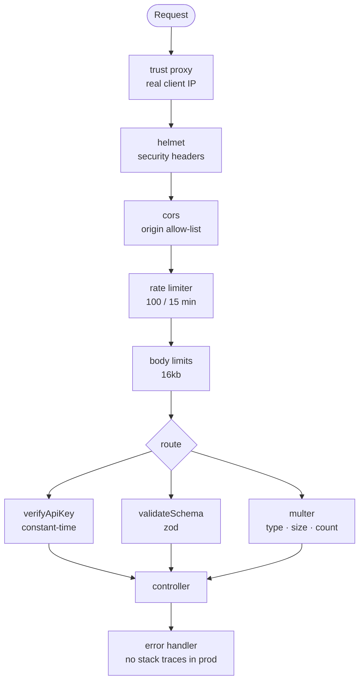

# 09 · Security

> The single most useful habit: **assume every byte from a client is hostile.**
> Not "might be" — _is_. A client is a program someone else controls.

This page covers what the template defends against, how each defence works, and
— just as importantly — **what it does not protect you from**.

## What is in the box



---

## Trust proxy

**The setting people get wrong, with the widest blast radius.**

```ini
TRUST_PROXY=false   # direct to the internet (default)
TRUST_PROXY=1       # behind exactly one proxy — nginx, ALB, Cloudflare
TRUST_PROXY=true    # ⚠️ trust every proxy
```

Express computes `req.ip` from the socket. Behind a load balancer that is
**always the balancer's address**, so:

- the rate limiter sees all traffic as one client — one abusive IP throttles
  everyone, or nobody gets limited at all
- every log line and error record shows the proxy's IP

Setting `trust proxy` makes Express read `X-Forwarded-For` instead. But that
header is **client-supplied**: with `true`, anyone can send
`X-Forwarded-For: 1.2.3.4` and rotate their apparent IP on every request,
bypassing rate limits entirely.

> **Rule: set the exact number of proxies you actually have.** One ALB → `1`.
> ALB behind Cloudflare → `2`. Nothing in front → `false`.

---

## Security headers (helmet)

```ts
app.use(helmet());
```

Fifteen HTTP headers, each closing a specific attack:

| Header                            | Stops                                            |
| --------------------------------- | ------------------------------------------------ |
| `Content-Security-Policy`         | XSS via injected scripts                         |
| `Strict-Transport-Security`       | Downgrade to plain HTTP                          |
| `X-Content-Type-Options: nosniff` | Browsers guessing a type and executing an upload |
| `X-Frame-Options: DENY`           | Clickjacking                                     |
| `Referrer-Policy`                 | URLs (with tokens) leaking to third parties      |
| `X-Powered-By` **removed**        | Free version fingerprinting                      |

For a pure JSON API the defaults are correct. If you ever serve HTML, tune the
CSP — the default `default-src 'self'` blocks inline scripts, which is the point.

---

## CORS

```ts
app.use(cors({ origin: env.app.CLIENT_URL, credentials: true }));
```

CORS is a **browser** mechanism: it decides which origins may _read_ your
responses from JavaScript. It stops a malicious site from calling your API with
a logged-in user's cookies and reading the result.

It is **not** server-side access control. `curl` ignores it entirely. CORS
protects your users from other websites; it does nothing against a direct
attacker.

```ini
CLIENT_URL=https://app.example.com,https://admin.example.com
```

> ⚠️ `origin: '*'` with `credentials: true` is rejected by every browser — and
> reflecting whatever `Origin` the client sent is the same as no protection at
> all. Keep an explicit allow-list.

---

## Rate limiting

```ts
windowMs: 15 * 60 * 1000,
limit: 100,
```

100 requests per IP per 15 minutes, globally. This is the cheapest defence
available: it blunts credential stuffing, scraping and accidental retry storms
before they reach any logic.

**Tighten it per route** for anything expensive or sensitive:

```ts
const authLimiter = rateLimit({ windowMs: 15 * 60 * 1000, limit: 5 });
router.post('/login', authLimiter, login); // 5 attempts / 15 min
```

Rough guidance: auth 5–10/15min, password reset 3/hour, search 30/min, reads
100–1000/15min.

### Throttling as an alternative

`slowDownApi` delays rather than rejects — friendlier where a burst is usually
impatience, not abuse (search-as-you-type, polling). Legitimate clients still
succeed; hammering becomes uneconomical.

### ⚠️ In-memory store

The default store lives in the process. With PM2 cluster mode or multiple
containers, **each worker keeps its own counter** — four workers means an
effective limit of 400, not 100. For anything multi-process use a shared store:

```ts
import { RedisStore } from 'rate-limit-redis';
export const rateLimiter = rateLimit({ store: new RedisStore({/* … */}) /* … */ });
```

---

## API key authentication

```ts
if (!safeCompare(apiKey, env.app.API_KEY)) throw new ApiError(401, 'E004', …);
```

### Timing attacks

```ts
if (apiKey !== ourApiKey) {
    /* ❌ */
}
```

`!==` returns as soon as it finds a differing byte, so **how long it takes leaks
how many leading characters were correct**. Over enough requests an attacker
reconstructs the key one byte at a time. `crypto.timingSafeEqual` always
compares the full length.

The same applies to password hashes, session tokens, HMAC signatures and reset
tokens — any secret comparison.

### The development escape hatch

```ts
if (env.app.NODE_ENV === 'development' && env.app.DISABLE_VALIDATE_API_KEY_ON_DEVELOPMENT) return next();
```

Both conditions are required. An earlier version checked only the flag, so a
stray `DISABLE_VALIDATE_API_KEY_ON_DEVELOPMENT=true` in a production `.env`
would have silently disabled authentication.

> **Any "disable security" flag must be impossible to enable in production.**
> Gate it on `NODE_ENV`.

### What an API key is not

A shared key authenticates a **client application**, not a **user**. It cannot
express "this user may edit only their own records". For that you need real
authentication (sessions or JWT) and authorization — neither is in this
template yet. See [17-extending.md](17-extending.md).

---

## Input validation

Every route that accepts input should use `validateSchema`. See
[06-validation.md](06-validation.md). The security-relevant parts:

- Unknown fields are stripped, so mass-assignment (`{"role":"admin"}`) fails
- Numeric bounds stop resource exhaustion (`?limit=1000000`)
- Types are enforced, so `{"id": {"$ne": null}}` never reaches a database driver

### Injection

This template ships no database, so the rules for when you add one:

```ts
db.query('SELECT * FROM users WHERE id = $1', [id]); // ✅ parameterised
db.query(`SELECT * FROM users WHERE id = '${id}'`); // ❌ concatenated
```

Same idea everywhere: parameterised queries for SQL, typed values for NoSQL
(reject objects where a string is expected), `execFile` with an argument array
instead of `exec` with a string, and an allow-list for any user-supplied path.

### Body size

```ts
app.use(express.json({ limit: '16kb' }));
```

Caps how much memory an anonymous request can make the server allocate. Raise it
per route where genuinely needed, not globally.

---

## File uploads

The defaults reject by type, size and count — see
[14-file-uploads.md](14-file-uploads.md). The rules that matter:

- `file.mimetype` is **client-supplied and forgeable**. For untrusted input,
  verify magic bytes.
- Never trust `file.originalname` — `../../etc/passwd` is a valid filename
  string. Generate your own.
- Never serve uploads from a path the application also executes.
- Memory storage means a 5 MB limit × concurrent uploads of heap. Stream large
  files to disk or object storage.

---

## Error disclosure

```ts
stack: isDevelopment ? error.stack : undefined;
```

Stack traces reveal file paths, dependency versions and internal structure.
Unrecognised errors return a generic message; the real one stays in the logs,
reachable through `errorId`. See [07-error-handling.md](07-error-handling.md).

---

## Secrets

| Rule                                            | Why                                                         |
| ----------------------------------------------- | ----------------------------------------------------------- |
| Secrets come from the environment, never source | Source is copied, forked and shared                         |
| `.env*` is gitignored (except `.env.example`)   | One commit is one leak                                      |
| `.dockerignore` excludes `.env*`                | Image layers persist even if a later layer deletes the file |
| `API_KEY` ≥ 16 chars, enforced at boot          | A short key is worse than none — it implies safety          |
| Never `logger.info(env)`                        | One line leaks everything                                   |
| Rotate on any suspicion                         | Rewriting git history does not un-clone a repo              |

Generate keys with `openssl rand -hex 32`, never by hand. In production prefer a
secrets manager (AWS Secrets Manager, Vault, Kubernetes secrets) over a file.

---

## The metrics endpoint

`/metrics` exposes route names, traffic shape, memory, versions and uptime —
reconnaissance material.

```ini
PROTECT_METRICS=true    # requires x-api-key
```

Leave it unprotected only when the port is genuinely unreachable from the
internet. When enabled, configure the scraper to send the header (see the
commented block in `prometheus.yml`).

---

## The API reference

`/docs` lists every route, its parameters and its error codes — useful to a
consumer, and equally useful to someone mapping your attack surface.

```ini
ENABLE_API_DOCS=      # unset: on in development, off in production
ENABLE_API_DOCS=true  # publish it deliberately
```

Publishing it is a legitimate choice for a public API; doing so _by accident_ is
not, which is why the default flips on `NODE_ENV`. The page relaxes its
Content-Security-Policy to load the renderer from a CDN — that relaxation
applies to `/docs` only, never to API responses.

---

## Dependencies

Most code in a Node application is code you did not write.

```bash
npm audit                     # what is known-vulnerable
npm audit fix                 # safe upgrades
npm outdated                  # how far behind you are
```

- `package-lock.json` is committed — it is what makes a build reproducible and
  what `npm ci` reads. Keep it in sync with `package.json`.
- Enable Dependabot or Renovate; small frequent upgrades beat one giant one.
- Prefer fewer dependencies. Every package is transitive trust.
- `eslint-plugin-security` is enabled here and catches some unsafe patterns
  statically.

---

## Container security

`dockerfile` applies four of the five things that matter:

```dockerfile
FROM node:22-alpine AS builder   # 1. multi-stage: no build tools in the runtime image
RUN npm ci --omit=dev            # 2. no devDependencies in production
USER node                        # 3. not root — a container escape starts unprivileged
HEALTHCHECK …                    # 4. the orchestrator can tell broken from slow
```

The fifth is pinning a digest (`node:22-alpine@sha256:…`) so a rebuild cannot
silently pull different bytes. Add it when your deployment cadence makes
reproducibility matter more than automatic patches.

---

## OWASP API Security Top 10 — status

| Risk                              | Status                                                                 |
| --------------------------------- | ---------------------------------------------------------------------- |
| API1 Broken object-level auth     | ❌ Not applicable yet — **your responsibility** when you add resources |
| API2 Broken authentication        | ⚠️ API key only; no user auth                                          |
| API3 Excessive data exposure      | ⚠️ Return DTOs, not raw records                                        |
| API4 Resource consumption         | ✅ Rate limit, slow-down, body and upload limits                       |
| API5 Broken function-level auth   | ❌ No roles yet                                                        |
| API6 Unrestricted sensitive flows | ⚠️ Add per-route limits on signup/reset                                |
| API7 SSRF                         | ⚠️ Validate any URL you fetch server-side                              |
| API8 Security misconfiguration    | ✅ helmet, CORS allow-list, validated config, no stack traces          |
| API9 Improper inventory           | ✅ Versioned routes, Postman collection, these docs                    |
| API10 Unsafe third-party APIs     | ⚠️ Validate SendGrid/provider responses too                            |

---

## Production checklist

Before exposing this to the internet:

- [ ] `NODE_ENV=production`
- [ ] `API_KEY` is a fresh 32-byte random value, not the example
- [ ] `TRUST_PROXY` matches your actual topology
- [ ] `CLIENT_URL` lists real origins — no wildcards
- [ ] `DISABLE_RATE_LIMITER=false`
- [ ] `DISABLE_VALIDATE_API_KEY_ON_DEVELOPMENT=false`
- [ ] `PROTECT_METRICS=true`, or the port is private
- [ ] `ENABLE_API_DOCS` is unset (off) unless a public reference is intended
- [ ] TLS terminated at the proxy; HTTP redirects to HTTPS
- [ ] Rate limiter uses a shared store if running more than one process
- [ ] Tighter limits on auth-shaped routes
- [ ] `npm audit` clean
- [ ] Logs shipped somewhere searchable, with no secrets in them
- [ ] Container runs as non-root
- [ ] Secrets injected by the platform, not read from a file on disk

## Not covered by this template

You must add these yourself:

- **Authentication** (sessions or JWT) and **authorization** (roles, ownership)
- **CSRF protection** — needed if you adopt cookie-based auth; not needed for
  `Authorization`-header APIs
- **Account lockout and MFA**
- **Audit logging** of sensitive actions
- **Encryption at rest**
- **A WAF** for layer-7 DDoS
