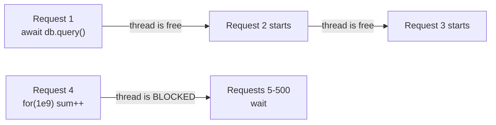

# 10 · Performance

## The mental model: one thread

Node runs your JavaScript on **a single thread**. There is no parallelism inside
one process — only interleaving while the thread waits on I/O.



Everything about Node performance follows from this:

| Work                                                          | Effect                                              |
| ------------------------------------------------------------- | --------------------------------------------------- |
| `await` on I/O (db, HTTP, disk)                               | Thread is released — **cheap**, scales to thousands |
| CPU work (loops, JSON of a huge object, crypto, image resize) | Thread is **blocked** — every other request waits   |

So the first performance question is never "is this function fast?" but
**"does this block the event loop?"**

### Blocking, concretely

```ts
const hash = crypto.pbkdf2Sync(password, salt, 100_000, 64, 'sha512'); // ❌ blocks ~100ms
await crypto.pbkdf2(password, salt, 100_000, 64, 'sha512'); // ✅ thread pool
```

100 ms of blocking at 50 req/s means every request queues behind it. The
`_sync` suffix in Node's API is a warning label: `fs.readFileSync`,
`zlib.gzipSync`, `execSync` — all fine at startup, all dangerous per request.

Watch out for CPU work that does not look like CPU work:

- `JSON.parse`/`stringify` on multi-megabyte payloads
- `array.sort()` / `.filter()` over 100k+ items
- Regular expressions that backtrack catastrophically (ReDoS)
- Synchronous template or image processing

**Fixes:** move it off the request path (a queue), push it to the database
(`ORDER BY`, `LIMIT`), use `worker_threads`, or cache the result.

### The template's own example

```ts
for (let j = 0; j < loopNumber; j++) {
    await new Promise((resolve) => setTimeout(resolve, 1000));
}
```

`/api/v0/example/metrics?loop=5` is _slow_ but never blocks — `await` releases
the thread each iteration. It exists to produce visible latency in Grafana. Note
the schema caps `loop` at 60: an unbounded value would be a free DoS.

---

## Concurrency: `await` in the right place

```ts
// ❌ 300ms — sequential for no reason
const user = await getUser(id);
const orders = await getOrders(id);
const credits = await getCredits(id);

// ✅ ~100ms — all three in flight together
const [user, orders, credits] = await Promise.all([getUser(id), getOrders(id), getCredits(id)]);
```

Use `Promise.all` when the calls are independent; keep `await` sequential only
when a later call genuinely needs an earlier result.

`Promise.allSettled` when one failure should not discard the rest.

### The N+1 problem

```ts
// ❌ 1 + N queries
const users = await db.users.findAll();
for (const user of users) user.orders = await db.orders.findByUser(user.id);

// ✅ 2 queries
const users = await db.users.findAll();
const orders = await db.orders.findByUserIds(users.map((u) => u.id));
```

This is the single most common backend performance bug. It is invisible with 10
rows in development and fatal with 10,000 in production.

---

## What the template already does

| Mechanism                         | Effect                                                       |
| --------------------------------- | ------------------------------------------------------------ |
| `compression()`                   | gzip on responses over ~1 kb — typically 70–90% smaller JSON |
| `express.json({ limit: '16kb' })` | Caps per-request allocation                                  |
| Handlebars template cache         | Compiles each email template once, not per send              |
| `prom-client` histograms          | Latency percentiles per route, so you optimise with data     |
| PM2 cluster mode                  | One process per core                                         |
| Multi-stage Docker build          | Smaller image, faster pulls and cold starts                  |

### Compression is not free

It costs CPU per response. Worth it for JSON over a network; skip it for
already-compressed payloads (images, video, `.zip`). If a reverse proxy already
compresses, do not do it twice:

```ts
app.use(compression({ filter: (req, res) => !req.headers['x-no-compression'] && compression.filter(req, res) }));
```

---

## Using every core

One Node process uses one core. A 4-core box running one process wastes 75% of
the hardware.

```js
// ecosystem.config.js
instances: process.env.PM2_INSTANCES || 'max',
exec_mode: 'cluster',
```

PM2 forks one worker per core and load-balances between them.

> ⚠️ **Inside a container, set `PM2_INSTANCES=1`.** `max` reads the _host's_
> core count, not the container's CPU quota — on a 64-core node with a 1-core
> limit, PM2 forks 64 workers that fight over 1 core. Scale by adding
> containers; that is what the orchestrator is for.

Cluster mode also means **anything in process memory is per-worker**: the
in-memory rate-limit counter, any local cache, any session store. Shared state
must live in Redis or a database.

---

## Caching

The cheapest request is the one you never serve.


| Layer                                  | Good for                                 | Watch out for                            |
| -------------------------------------- | ---------------------------------------- | ---------------------------------------- |
| HTTP headers (`Cache-Control`, `ETag`) | Public, rarely-changing responses        | Never cache per-user data at a CDN       |
| CDN                                    | Static assets, public endpoints          | Invalidation                             |
| Redis                                  | Query results, sessions, computed values | Staleness, memory limits                 |
| In-process `Map`                       | Tiny, read-only, per-process data        | Per-worker duplication, unbounded growth |

Start by measuring. An added cache is an added correctness problem; only take it
on when the data says you need it.

---

## Database performance

When you add one (see [17-extending.md](17-extending.md)):

1. **Index what you filter, sort and join on.** A missing index is the most
   common cause of a slow endpoint.
2. **Use a connection pool.** Opening a connection per request is expensive;
   size the pool to the database's limit divided by your process count.
3. **Select only the columns you need.** `SELECT *` over wide rows wastes
   network and memory.
4. **Paginate everything.** Any endpoint that can return "all" rows will
   eventually be asked to.
5. **Read query plans.** `EXPLAIN ANALYZE` beats guessing.

---

## Measuring

**Never optimise without a measurement.** The bottleneck is almost never where
it feels like it is.

### Latency, per route

`/metrics` already exposes the histogram:

```promql
histogram_quantile(0.95, sum(rate(http_request_duration_seconds_bucket[5m])) by (le, route))
```

Track **p95 and p99**, not the average. An average of 50 ms can hide 1% of users
waiting 4 seconds — and that 1% includes your biggest accounts.

### Load testing

```bash
npx autocannon -c 100 -d 30 http://localhost:8080/api/v0/health
```

Test against a **production-like build** (`npm run build && npm start`), not
`npm run dev`. Watch requests/sec, latency percentiles, and errors together — a
high throughput number with 30% errors is not throughput.

### Profiling

```bash
node --prof build/server.js
node --prof-process isolate-*.log > profile.txt      # where CPU time went

node --inspect build/server.js                       # chrome://inspect → heap snapshots
```

For a suspected memory leak, take two heap snapshots minutes apart under load
and compare retained objects.

### Event loop lag

`collectDefaultMetrics()` exposes `nodejs_eventloop_lag_seconds`. Sustained lag
above ~100 ms means something is blocking the thread — go find it. This is the
single most valuable Node metric to alert on.

---

## Rough targets

| Metric         | Healthy         | Investigate                 |
| -------------- | --------------- | --------------------------- |
| p50 latency    | < 100 ms        | > 300 ms                    |
| p95 latency    | < 500 ms        | > 1 s                       |
| Event loop lag | < 50 ms         | > 100 ms sustained          |
| Heap used      | Stable sawtooth | Monotonically rising = leak |
| Error rate     | < 0.1%          | > 1%                        |

---

## Checklist

- [ ] No `*Sync` calls on the request path
- [ ] Independent async calls use `Promise.all`
- [ ] No N+1 queries
- [ ] Every list endpoint paginates, with a bounded `limit`
- [ ] Indexes on filtered/sorted columns
- [ ] `PM2_INSTANCES=1` inside containers, `max` on a VM
- [ ] Shared state in Redis, not process memory
- [ ] p95/p99 dashboards exist before you start tuning
- [ ] Load tested against a production build
