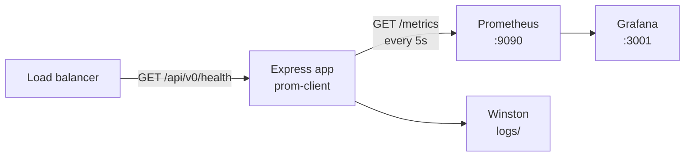

# 11 · Observability

> Monitoring tells you **that** something is wrong. Observability lets you work
> out **why** without shipping new code.

Three signals, all present in this template:

| Signal      | Answers                                  | Where                                        |
| ----------- | ---------------------------------------- | -------------------------------------------- |
| **Metrics** | How many? How fast? How often failing?   | `/metrics` → Prometheus → Grafana            |
| **Logs**    | What exactly happened to _this_ request? | Winston → files/stdout → [08](08-logging.md) |
| **Health**  | Is the process alive and serving?        | `/api/v0/health`                             |

_(Traces — following one request across services — are the fourth. Add
OpenTelemetry when you have more than one service.)_

---

## The stack



```bash
npm run setup -- .env.production   # generates an API_KEY; review the rest
npm run docker:up
```

| Service    | URL                   | Login         |
| ---------- | --------------------- | ------------- |
| API        | http://localhost:8080 | —             |
| Prometheus | http://localhost:9090 | —             |
| Grafana    | http://localhost:3001 | admin / admin |

**First-time Grafana setup:** Connections → Add data source → Prometheus →
URL `http://prometheus:9090` (the compose service name) → Save & test.

---

## What is measured

```ts
new client.Histogram({
    name: 'http_request_duration_seconds',
    labelNames: ['method', 'route', 'status_code'],
    buckets: [0.01, 0.05, 0.1, 0.3, 0.5, 0.7, 1, 2, 5],
});

new client.Counter({ name: 'http_requests_total', labelNames: ['method', 'route', 'status_code'] });
```

Together with `collectDefaultMetrics()` (heap, GC, event loop lag, file
descriptors, CPU) that covers the **RED method**:

- **R**ate — `http_requests_total`
- **E**rrors — the same counter filtered by `status_code`
- **D**uration — `http_request_duration_seconds`

### Metric types

| Type          | Meaning                          | Example                                  |
| ------------- | -------------------------------- | ---------------------------------------- |
| **Counter**   | Only goes up (resets on restart) | Requests served                          |
| **Gauge**     | Goes up and down                 | Memory in use, active connections        |
| **Histogram** | Distribution in buckets          | Request duration                         |
| **Summary**   | Client-side quantiles            | Rarely what you want — prefer histograms |

Buckets decide which questions you can answer later. The set above suits a
"fast API"; if your p99 lives above 5 s, widen it. **You cannot re-bucket
historical data**, so choose deliberately.

---

## Cardinality: the one way to break Prometheus

Every unique combination of label values is a separate time series stored in
memory.

```ts
route: req.path; // ❌ /users/1, /users/2, … unbounded
route: '/users/:id'; // ✅ one series
```

Using the raw path means a scanner hitting random URLs can exhaust the server's
memory. This template captures the **matched route pattern** and collapses
everything unmatched into `unmatched`:

```ts
// src/metrics/prometheus.ts
return () => matchedPattern ?? 'unmatched';
```

> There is a subtlety worth knowing: by the time `res.on('finish')` fires for an
> _error_ response, Express has unwound the router stack and reset `req.baseUrl`.
> Reading it there reports `/api-key` for a 401 and `/api/v0/example/api-key` for
> a 200 — one endpoint split across two series. The module intercepts the
> assignment to `req.route` instead, which is the moment both values are correct.

**Never label with:** user id, email, request id, raw URL, full error message,
or anything else unbounded. Those belong in logs, not metrics.

---

## Queries to start with

```promql
# Requests per second, by route
sum(rate(http_requests_total[5m])) by (route)

# Error rate (%)
100 * sum(rate(http_requests_total{status_code=~"5.."}[5m])) / sum(rate(http_requests_total[5m]))

# p95 latency per route
histogram_quantile(0.95, sum(rate(http_request_duration_seconds_bucket[5m])) by (le, route))

# Event loop lag — the most valuable Node metric
nodejs_eventloop_lag_seconds

# Heap growth — a steady climb means a leak
nodejs_heap_size_used_bytes
```

**Use percentiles, not averages.** An average of 50 ms can hide 1% of users
waiting 4 seconds.

---

## Adding your own metric

```ts
// src/metrics/prometheus.ts
export const emailsSent = new client.Counter({
    name: 'emails_sent_total',
    help: 'Emails sent, by template and outcome',
    labelNames: ['template', 'status'], // both bounded sets
});
```

```ts
emailsSent.inc({ template: 'welcome', status: 'success' });
```

Naming rules Prometheus expects: `snake_case`, a unit suffix
(`_seconds`, `_bytes`, `_total`), and base units (seconds, not milliseconds).

**Measure what you would be asked about in an incident:** signups per minute,
payment failures, queue depth, cache hit ratio.

---

## Health checks

```bash
curl http://localhost:8080/api/v0/health
```

```json
{
    "data": {
        "application": {
            "environment": "production",
            "uptime": "3600.00 Second",
            "memoryUsage": { "heapTotal": "56.28 MB", "heapUsed": "27.23 MB" }
        },
        "system": { "cpuUsage": [0.5, 0.4, 0.3], "totalMemory": "8192.00 MB", "freeMemory": "134.86 MB" },
        "timestamp": 1758891234567
    }
}
```

Used by the Docker `HEALTHCHECK`, the compose healthcheck, and any load balancer
you put in front.

### Liveness vs readiness

| Check         | Question                          | Wrong answer costs you            |
| ------------- | --------------------------------- | --------------------------------- |
| **Liveness**  | Is the process alive?             | Restart loops                     |
| **Readiness** | Can it serve traffic _right now_? | 500s sent to users during startup |

The current endpoint is a **liveness** check: it never touches a dependency. If
you add a database, add a readiness endpoint that does:

```ts
export const getReadiness = asyncCatch(async (req, res) => {
    await db.ping(); // fail → 503 → taken out of rotation
    customSuccessResponse(res, 200, req.t('good_api_health_check'), { ready: true });
});
```

> ⚠️ Do not put dependency checks in the _liveness_ probe. A brief database
> blip would then restart every healthy container — turning a small problem into
> an outage.

💡 The health response exposes memory and CPU figures. On a public endpoint
that is mild information disclosure; trim it, or move it behind the same guard
as `/metrics`.

---

## Alerts worth having

Alert on **symptoms users feel**, not on causes:

| Alert              | Condition                            |
| ------------------ | ------------------------------------ |
| High error rate    | 5xx rate > 1% for 5 minutes          |
| Latency regression | p95 > 1 s for 10 minutes             |
| Event loop blocked | lag > 100 ms for 5 minutes           |
| Memory climbing    | heap up and to the right over 1 hour |
| Service down       | `up == 0` for 2 minutes              |

Rules of thumb: alert only on things a human should act on _now_; everything
else is a dashboard. An alert that fires and is routinely ignored is worse than
no alert.

---

## Securing the endpoints

`/metrics` reveals route names, traffic shape, versions and uptime.

```ini
PROTECT_METRICS=true
```

Then configure the scraper (see the commented `http_headers` block in
`prometheus.yml`). Alternatively bind it to a private network and never publish
the port.

---

## Production checklist

- [ ] Prometheus scraping the app, with retention configured
- [ ] Grafana dashboards for rate, errors, p95/p99, event loop lag, heap
- [ ] Alerts routed somewhere a human actually reads
- [ ] `/metrics` protected or private
- [ ] Readiness probe checks real dependencies; liveness does not
- [ ] Logs shipped and searchable by `requestId`/`errorId`
- [ ] No unbounded metric labels
