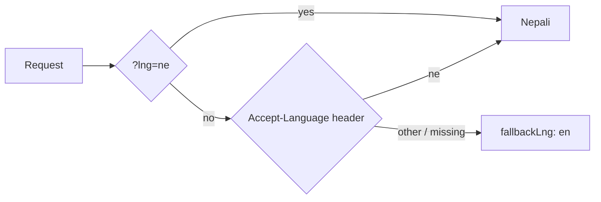

# 12 · Internationalization (i18n)

## The rule

> **No user-facing string is written in the source code.** Every one comes from
> `locales/`, through `req.t`.

```ts
customSuccessResponse(res, 200, t('email_sent'), data); // ✅
customSuccessResponse(res, 200, 'Email sent', data); // ❌
```

Even if you only ever ship English, this pays for itself: all copy lives in one
place, a wording change is a one-line JSON edit with no redeploy of logic, and
adding a language later is a new folder instead of a refactor.

## How a language is chosen



```ts
detection: { order: ['querystring', 'header'], lookupQuerystring: 'lng', lookupHeader: 'accept-language' }
```

An explicit `?lng=ne` beats the browser's header — which is what you want for a
language switcher, and for testing:

```bash
curl "http://localhost:8080/api/v0/example/localization?lng=ne"
curl -H "Accept-Language: ne" http://localhost:8080/api/v0/example/localization
```

## Catalogue layout

```
locales/
├── en/
│   ├── translation.json   default namespace: general UI copy
│   ├── auth.json          auth flows
│   └── error.json         every error message
└── ne/
    └── … the same three files
```

Namespaces keep files readable as the app grows:

```ts
req.t('welcome'); // translation (default)
req.t('route_not_found_message', { ns: 'error' }); // error namespace
req.t('login_success', { ns: 'auth' }); // auth namespace
```

> `locales/` lives **outside `src/`** on purpose: `tsc` only emits `.js`, so
> JSON kept next to the source would vanish from the production build. See
> [03-project-structure.md](03-project-structure.md).

## Key naming

Errors use a **three-key triple**, matching the API error contract:

```json
{
    "file_too_large_message": "File too large.",
    "file_too_large_details": "The uploaded file exceeds the maximum allowed file size.",
    "file_too_large_suggestion": "Please upload a smaller file and try again."
}
```

Conventions:

- `snake_case`
- Name by **meaning**, not by text: `file_too_large`, not `error_5`
- Keep the triple complete — `_message`, `_details`, `_suggestion`
- Same keys in every language file (see "Keeping languages in sync" below)

## Interpolation

```json
{ "unsupported_file_type_details": "Files of type {{type}} are not accepted by this endpoint." }
```

```ts
req.t('unsupported_file_type_details', { ns: 'error', type: file.mimetype });
```

Formatters are available too:

```ts
req.t('greeting', { name: 'suman', formatParams: { name: { format: 'uppercase' } } });
```

### Why escaping is off

```ts
interpolation: {
    escapeValue: false;
}
```

i18next HTML-escapes interpolated values by default — sensible for a template
engine, wrong for a JSON API, where it turns `image/png` into `image&#x2F;png`
inside a JSON field.

Escaping belongs at the point a value is **rendered into HTML**, which is the
client's job. If you ever render these strings server-side into HTML, turn it
back on.

## Typed keys

`src/types/i18n.d.ts` feeds the JSON files back into TypeScript:

```ts
declare module 'i18next' {
    interface CustomTypeOptions {
        resources: { translation: typeof translation; auth: typeof auth; error: typeof error };
    }
}
```

So a typo is a **compile error**, not a raw key shown to a user:

```ts
req.t('welcom'); // ❌ Argument of type '"welcom"' is not assignable …
```

The same file exports `ErrorMessageKey`, which is what lets the error handler
pick a translation key dynamically and still be type-checked:

```ts
const UPLOAD_ERRORS: Record<string, { keys: readonly [ErrorMessageKey, ErrorMessageKey, ErrorMessageKey] }> = { … };
```

⚠️ Types are derived from the **English** files. A key present only in `ne/`
will not type-check — which is the correct direction for the constraint.

## Startup

```ts
export const i18nReady = i18next.use(Backend).use(middleware.LanguageDetector).init({ … });
```

`src/server.ts` awaits it before listening:

```ts
await i18nReady;
```

Without that, the first requests after a restart could be answered with raw
translation keys — an intermittent bug that never reproduces locally.

## Adding a language

1. `mkdir locales/fr` and copy the three JSON files from `en/`
2. Translate the **values**; never touch the keys
3. Add it to `preload`:

```ts
preload: ['en', 'ne', 'fr'],
```

Preloading reads the files at startup rather than on the first request that
needs them — a small startup cost for predictable latency.

## Keeping languages in sync

A missing key silently falls back to English, so drift is invisible until a user
reports it. Check with:

```bash
for ns in translation auth error; do
  echo "== $ns"
  diff <(jq -r 'keys[]' locales/en/$ns.json) <(jq -r 'keys[]' locales/ne/$ns.json)
done
```

💡 Worth adding to CI once you have more than two languages.

## Common mistakes

| Mistake                             | Consequence                                                |
| ----------------------------------- | ---------------------------------------------------------- |
| Hard-coded English string           | Untranslatable; breaks the contract                        |
| Forgetting `{ ns: 'error' }`        | Key looked up in `translation` → falls back to the raw key |
| Building sentences by concatenation | Word order differs between languages                       |
| Key named after its English text    | Renaming the copy forces a code change                     |
| Adding a key to `en` only           | Other languages silently fall back                         |
| `req.t` in a non-request context    | Not available — use `i18next.t` with an explicit `lng`     |

### Concatenation

```ts
t('you_have') + ' ' + count + ' ' + t('items'); // ❌ breaks in most languages
t('you_have_items', { count }); // ✅ one key, plural-aware
```

i18next handles plurals natively:

```json
{ "you_have_items_one": "You have {{count}} item", "you_have_items_other": "You have {{count}} items" }
```
