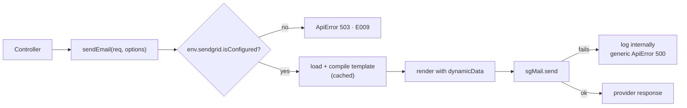

# 13 · Email

## How it works



```ts
const [emailResponse] = await sendEmail(req, {
    to: payload.to,
    subject: 'Express Template',
    templatePath: 'public/welcome.template.html', // relative to templates/email/
    dynamicData: { name, role, year: new Date().getFullYear() },
});
```

## Templates live in the repo, not the dashboard

```
templates/email/
├── public/welcome.template.html
└── example/notification.template.html
```

SendGrid can host templates for you. Keeping them here instead means they are
**code-reviewed, versioned with the feature that sends them, diffable, and
usable offline** — and you are not locked to one provider.

> Templates sit **outside `src/`** because `tsc` only emits `.js`. An `.html`
> file next to your TypeScript disappears from the production build — this was a
> real bug in an earlier version of this template.

Paths are resolved from the working directory:

```ts
const TEMPLATE_DIR = path.resolve(process.cwd(), 'templates/email');
```

⚠️ So the server must be started from the repository root.

## Handlebars

```html
<h1>Welcome, {{name}}!</h1>
<p>Your role: {{role}}</p>
<p>&copy; {{year}} ExpressTemplate</p>

{{#if isPremium}}
<p>Thanks for subscribing.</p>
{{/if}}

<ul>
    {{#each items}}
    <li>{{this.name}} — {{this.price}}</li>
    {{/each}}
</ul>
```

`{{value}}` escapes HTML. `{{{value}}}` does not — **only ever use the triple
form on content you generated yourself**, never on user input.

## Caching

```ts
const templateCache = new Map<string, HandlebarsTemplateDelegate>();
```

Compiling Handlebars is CPU work. Each template is compiled once and reused —
except in development, where the cache is bypassed so edits show up without a
restart.

## Optional configuration

The server boots without SendGrid credentials. Calling `sendEmail` while
unconfigured returns:

```json
{
    "statusCode": 503,
    "error": {
        "code": "E009",
        "message": "Email service is not configured.",
        "suggestion": "Please set SEND_GRID_API_KEY and SEND_GRID_FROM_EMAIL and restart the server."
    }
}
```

A fork that never sends email should not have to invent credentials to start.
But an unconfigured optional feature must still **fail loudly when used** —
never silently no-op. See [04-configuration.md](04-configuration.md).

## Setup

1. Create an API key with **Mail Send** permission only —
   [app.sendgrid.com/settings/api_keys](https://app.sendgrid.com/settings/api_keys)
2. Verify a sender address —
   [sender auth](https://app.sendgrid.com/settings/sender_auth/senders/new)
3. Add both to `.env.local`:

```ini
SEND_GRID_API_KEY=SG.xxxxx
SEND_GRID_FROM_EMAIL=noreply@yourdomain.com
```

> Least privilege: a Mail-Send-only key cannot read your contacts or change
> account settings if it leaks.

## Security

**Path traversal.** `templatePath` is validated to stay inside the template
directory:

```ts
if (!resolved.startsWith(TEMPLATE_DIR + path.sep)) throw new Error(…);
```

Without it, a user-influenced path like `../../.env` would be a readable
template — and its contents would be mailed to whoever asked. The guard is
cheap, and it means the invariant holds even if someone later wires a request
field into that argument.

**Header injection.** Never build recipient or subject strings from unvalidated
input; a newline in a header field can inject extra headers. `sendEmailSchema`
validates `to` as an email, which is the defence.

**Error messages.** The provider's error may contain the API key or recipient
data, so it is logged server-side and a generic `ApiError` is returned:

```ts
logger.error('Failed to send email', { error });
throw new ApiError(500, 'E001', t('email_not_sent_message', { ns: 'error' }), …);
```

**Enumeration.** "That email is not registered" tells an attacker which accounts
exist. Return the same response either way for password-reset flows.

## Sending should not block the request

```ts
await sendEmail(req, options); // the user waits for SendGrid
```

Fine for a transactional endpoint whose whole purpose is the email. Wrong for
signup: a slow provider makes registration slow, and a provider outage makes it
fail.

```ts
// Signup succeeds even if the welcome email does not
sendEmail(req, options).catch((error) => logger.error('Welcome email failed', { error, userId }));
```

For anything that must eventually arrive, use a queue (BullMQ, SQS) with retries
and a dead-letter queue. Fire-and-forget without logging is the one option that
is always wrong.

## Adding a template

1. Create `templates/email/<folder>/<name>.template.html`
2. Use `{{placeholders}}` for every dynamic value
3. Call it:

```ts
await sendEmail(req, {
    to: user.email,
    subject: req.t('password_reset_subject', { ns: 'auth' }),
    templatePath: 'auth/password-reset.template.html',
    dynamicData: { name: user.name, resetUrl, expiresInMinutes: 30 },
});
```

### Writing HTML email

Email clients render like it is 2005:

- Tables for layout, not flexbox or grid
- Inline CSS — `<style>` blocks are stripped by several clients
- Max width ~600px
- Always provide a plain-text alternative
- Test in [Litmus](https://litmus.com) or [Email on Acid](https://emailonacid.com)
- Absolute URLs for every image and link

## Deliverability

Authenticate your domain, or your mail lands in spam:

| Record    | Purpose                                       |
| --------- | --------------------------------------------- |
| **SPF**   | Lists who may send as your domain             |
| **DKIM**  | Cryptographically signs your mail             |
| **DMARC** | Tells receivers what to do when SPF/DKIM fail |

SendGrid's domain authentication flow sets these up. Also: honour unsubscribes,
keep bounce rates low, and never buy a list.

## Testing without sending

| Tool                                          | Use                                      |
| --------------------------------------------- | ---------------------------------------- |
| [Mailtrap](https://mailtrap.io)               | Catches mail in a fake inbox             |
| [MailHog](https://github.com/mailhog/MailHog) | Same, self-hosted via Docker             |
| SendGrid sandbox mode                         | Validates the request without delivering |

Never test against real addresses — one loop over a user table is a very bad
afternoon.

## Switching providers

`sendEmail` is the only place that knows about SendGrid. To move to SES,
Postmark or Resend, reimplement that one function; controllers do not change.
That is the payoff of keeping integrations behind a small interface.
