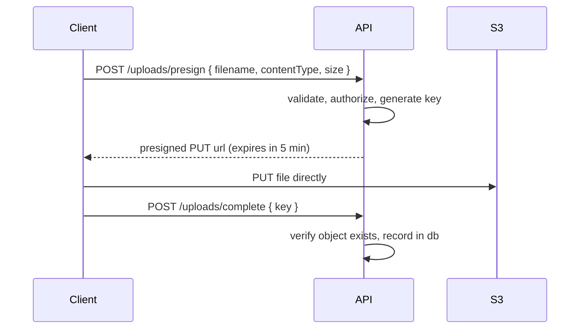

# 14 · File Uploads

> Uploads are the most common way a web server becomes free storage, a malware
> host, or an out-of-memory crash. Three limits are on by default here, and none
> of them should be removed.

## Usage

```ts
// src/router/example.route.ts
const uploadExampleFile = createUploadMiddleware({
    allowedTypes: ['image/jpeg', 'image/png', 'application/pdf'],
    maxFileSize: 2 * 1024 * 1024,
    maxFiles: 1,
});

exampleRouter.post('/file-upload', uploadExampleFile.single('example_file'), fileUploadExample);
```

```ts
// controller
const file = req.file as Express.Multer.File;
if (!file) throw new ApiError(STATUS_CODES.NOT_FOUND, ERROR_CODES.NOT_FOUND, …);

file.originalname;  // "photo.png"  ← client-supplied, do not trust
file.mimetype;      // "image/png"  ← client-supplied, do not trust
file.size;          // bytes        ← real
file.buffer;        // Buffer       ← the bytes themselves
```

| Multer method                                                               | Result                       |
| --------------------------------------------------------------------------- | ---------------------------- |
| `.single('field')`                                                          | `req.file`                   |
| `.array('field', 5)`                                                        | `req.files` (array)          |
| `.fields([{ name: 'avatar', maxCount: 1 }, { name: 'docs', maxCount: 3 }])` | `req.files` (object)         |
| `.none()`                                                                   | Multipart form with no files |

A default `upload` instance with safe defaults is also exported
(5 MB, 5 files, images + PDF) — use `createUploadMiddleware()` when a route
needs different limits.

## The three limits

```ts
multer({
    fileFilter, // 1. MIME allow-list
    storage: multer.memoryStorage(),
    limits: { fileSize: maxFileSize, files: maxFiles }, // 2. size  3. count
});
```

| Limit               | Without it                                           |
| ------------------- | ---------------------------------------------------- |
| **Type allow-list** | Anyone uploads `.exe`, `.php`, `.svg` (XSS), `.html` |
| **Size**            | One request exhausts memory or disk                  |
| **Count**           | "Upload 10,000 tiny files" exhausts file handles     |

The size limit is enforced **while streaming**, so an oversized file is rejected
before it is fully buffered — not after.

### Errors are translated automatically

Multer throws `MulterError`; `apiErrorHandler` maps each code to the standard
envelope, so the client never sees a library's English-only message:

| Multer code              | Response                                |
| ------------------------ | --------------------------------------- |
| `LIMIT_FILE_SIZE`        | 413 · `E007` · "File too large."        |
| `LIMIT_FILE_COUNT`       | 400 · `E006` · "Too many files."        |
| `LIMIT_UNEXPECTED_FILE`  | 400 · `E006` · "Unexpected file field." |
| rejected by `fileFilter` | 415 · `E008` · "Unsupported file type." |

## ⚠️ `mimetype` is a client-supplied string

```bash
curl -F "example_file=@malware.exe;type=image/png" …
```

The allow-list stops honest mistakes and casual abuse. For genuinely untrusted
input, **check the magic bytes**:

```ts
import { fileTypeFromBuffer } from 'file-type';

const detected = await fileTypeFromBuffer(file.buffer);
if (!detected || !allowedTypes.includes(detected.mime)) {
    throw new ApiError(STATUS_CODES.UNSUPPORTED_MEDIA_TYPE, ERROR_CODES.UNSUPPORTED_MEDIA_TYPE, …);
}
```

Also: **never trust `originalname`**. `../../../etc/cron.d/x` is a valid
filename string. Generate your own:

```ts
import { v4 as uuid } from 'uuid';
import path from 'path';

const safeName = `${uuid()}${path.extname(file.originalname).toLowerCase().slice(0, 10)}`;
```

## Storage strategies

```ts
multer.memoryStorage(); // the template's default
```

| Strategy            | Good for                                                 | Cost                                               |
| ------------------- | -------------------------------------------------------- | -------------------------------------------------- |
| **Memory**          | Validate then forward to S3/Firebase; images under ~5 MB | Whole file in heap — 5 MB × 20 concurrent = 100 MB |
| **Disk**            | Large files, local processing                            | Needs cleanup; not shared between containers       |
| **Direct to cloud** | Anything large or high-volume                            | Most setup, best scaling                           |

### Disk storage

```ts
const storage = multer.diskStorage({
    destination: (req, file, cb) => cb(null, '/var/app/uploads'),
    filename: (req, file, cb) => cb(null, `${uuid()}${path.extname(file.originalname)}`),
});
```

⚠️ Delete temporary files in a `finally` block — a failed request that leaves
its upload behind fills the disk over weeks.

### Direct-to-cloud (presigned URLs)

For anything large, the file should never touch your server:



Your server spends no bandwidth, memory or time on the bytes. This is the right
default above ~10 MB or for video.

## Serving uploads

- **Never** serve user uploads from a directory the application can execute
- **Never** serve them from your API's own origin if they may contain HTML or
  SVG — a stored XSS then runs with your origin's privileges
- Use a separate domain or bucket, and set
  `Content-Disposition: attachment` plus `X-Content-Type-Options: nosniff`
- For private files, generate short-lived presigned GET URLs rather than
  proxying bytes

## Complete example

```ts
export const uploadAvatar = asyncCatch(async (req: Request, res: Response) => {
    const t = req.t;
    const file = req.file;

    if (!file) throw new ApiError(STATUS_CODES.BAD_REQUEST, ERROR_CODES.VALIDATION_ERROR, …);

    // 1. Verify the real type, not the declared one
    const detected = await fileTypeFromBuffer(file.buffer);
    if (!detected || !['image/jpeg', 'image/png'].includes(detected.mime)) {
        throw new ApiError(STATUS_CODES.UNSUPPORTED_MEDIA_TYPE, ERROR_CODES.UNSUPPORTED_MEDIA_TYPE, …);
    }

    // 2. Our name, not theirs
    const key = `avatars/${req.user.id}/${uuid()}.${detected.ext}`;

    // 3. Store, then record
    await storage.put(key, file.buffer, { contentType: detected.mime });
    await db.users.update(req.user.id, { avatarKey: key });

    customSuccessResponse(res, 200, t('file_upload'), { key });
});
```

## Checklist

- [ ] Type allow-list (`fileFilter`)
- [ ] Size limit, sized for the use case rather than "generous"
- [ ] File count limit
- [ ] Magic-byte verification for untrusted sources
- [ ] Generated filenames — never `originalname`
- [ ] Uploads stored outside the web root, on a separate origin
- [ ] Virus scanning if users share files with each other (ClamAV, S3 malware scanning)
- [ ] Per-user quota, so one account cannot fill your storage
- [ ] Temporary files cleaned up on both success and failure
- [ ] Tighter rate limits on upload routes than on reads
