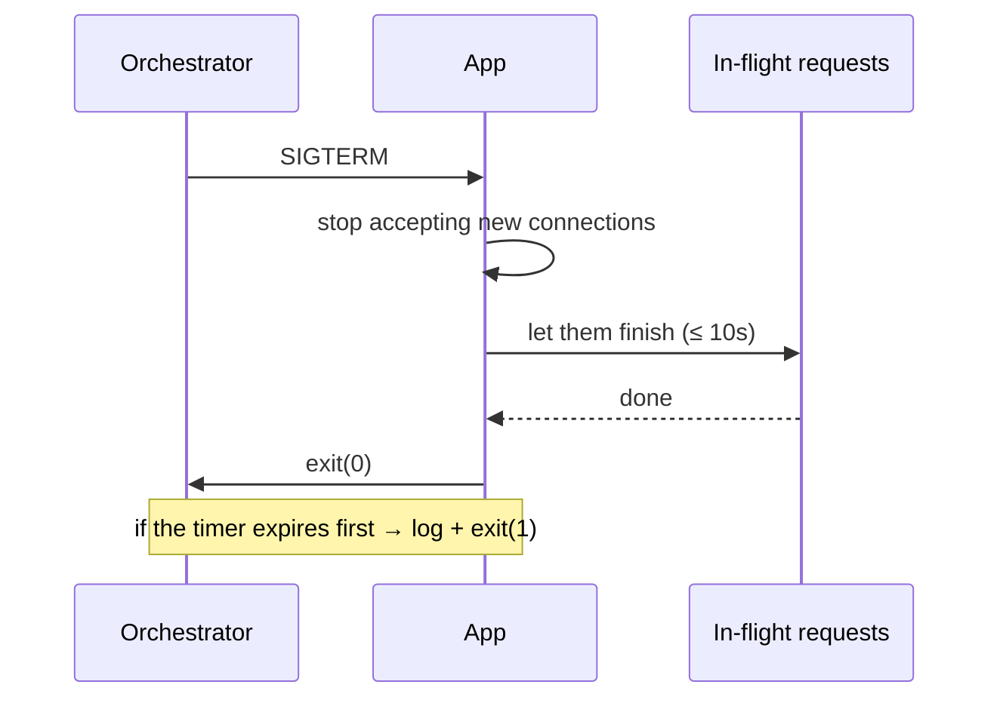
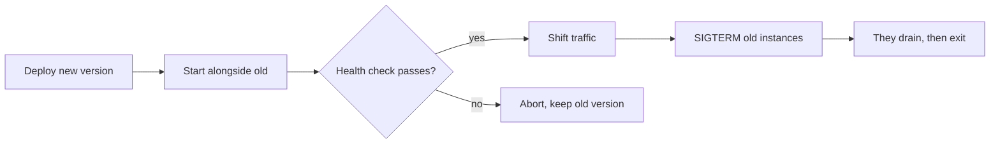

# 15 · Deployment

> Topology diagram: [`diagrams/architecture.drawio.xml`](diagrams/architecture.drawio.xml)
> — paste it into [app.diagrams.net](https://app.diagrams.net/) via
> **Extras → Edit Diagram**.

## Build

```bash
npm run build     # tsc → build/, then resolve-tspaths rewrites @/ aliases
npm start         # cross-env NODE_ENV=production node build/server.js
```

Both halves of `build` are required. TypeScript does not rewrite path aliases,
so without `resolve-tspaths` the output still says `require("@/config/env")` and
Node cannot resolve it — "builds fine, crashes on start".

⚠️ **Start from the repository root.** `locales/` and `templates/` are resolved
from the working directory, so `cd build && node server.js` will not find them.

### What ships

| Ships                               | Does not ship                  |
| ----------------------------------- | ------------------------------ |
| `build/`                            | `src/`                         |
| `locales/`, `templates/`, `public/` | `docs/`, `.github/`, `.husky/` |
| `package.json` + lockfile           | devDependencies                |
| `ecosystem.config.js`               | Any `.env*` file               |

---

## Docker

```bash
docker build -f dockerfile -t express-template .
docker run -p 8080:8080 --env-file .env.production express-template
```

The image is multi-stage:

```dockerfile
FROM node:22-alpine AS builder   # has TypeScript and every devDependency
RUN npm ci
RUN npm run build

FROM node:22-alpine AS runner    # clean image, production dependencies only
RUN npm ci --omit=dev && npm cache clean --force
COPY --from=builder /app/build ./build
COPY locales ./locales
COPY templates ./templates
USER node
HEALTHCHECK … CMD wget -qO- "http://127.0.0.1:${PORT:-8080}/api/v0/health"
```

Why each part earns its place:

| Decision                               | Reason                                                                         |
| -------------------------------------- | ------------------------------------------------------------------------------ |
| Multi-stage                            | No compiler or devDependencies in the runtime image — smaller, less to exploit |
| `COPY package*.json` before the source | Docker caches the install layer; a source change does not reinstall everything |
| `USER node`                            | A container escape starts unprivileged, not as root                            |
| `HEALTHCHECK`                          | The orchestrator can tell "broken" from "slow to start"                        |
| `.dockerignore` excludes `.env*`       | Secrets baked into a layer survive even if a later layer deletes them          |

⚠️ **This project uses npm.** `package-lock.json` is committed and `npm ci`
depends on it. Installing with another package manager locally is fine — their
lock files are gitignored — but do not commit one, and do not let
`package-lock.json` drift: `npm ci` fails if it disagrees with `package.json`.

### Compose (with monitoring)

```bash
npm run setup -- .env.production   # generates an API_KEY; review the rest
npm run docker:up
```

Runs the API (8080), Prometheus (9090) and Grafana (3001). Grafana is mapped to
3001 because 3000 is usually a local frontend.

⚠️ The app **refuses to start** without `CLIENT_URL` and `API_KEY`, which is why
`env_file: .env.production` is required rather than optional.

---

## PM2

```bash
npm run pm2:prod
pm2 logs / pm2 monit / pm2 status
```

```js
instances: process.env.PM2_INSTANCES || 'max',
exec_mode: 'cluster',
max_memory_restart: '512M',
kill_timeout: 10000,
```

One Node process uses one CPU core. Cluster mode forks a worker per core and
load-balances between them.

> ⚠️ **In a container, set `PM2_INSTANCES=1`.** `max` reads the _host's_ core
> count, not the container's CPU quota — on a 64-core node with a 1-core limit
> PM2 forks 64 workers that fight over one core. Scale with more containers.

`kill_timeout: 10000` matches `SHUTDOWN_TIMEOUT_MS` in `src/server.ts`, so PM2
waits for the app's own graceful shutdown instead of cutting it short.

### Where to run what

| Environment      | Process model                                     |
| ---------------- | ------------------------------------------------- |
| VM / bare metal  | PM2 cluster, `instances: max`                     |
| Docker / Compose | One Node process per container, `PM2_INSTANCES=1` |
| Kubernetes / ECS | One process per pod or task; scale with replicas  |

---

## Graceful shutdown



```ts
const forceExit = setTimeout(() => {
    logger.error('Could not close connections in time');
    process.exit(1);
}, 10_000);
forceExit.unref();
server.close(() => {
    logger.info('Server is shut down');
    process.exit(0);
});
```

The **timer is the important half**. Without it, one hung request keeps the
process alive until the orchestrator SIGKILLs it — and every other in-flight
request dies with it.

### Keep-alive timeouts

```ts
server.keepAliveTimeout = 65_000;
server.headersTimeout = 66_000;
```

Must be **longer** than the idle timeout of any load balancer in front (AWS ALB
defaults to 60 s). If Node closes a connection the balancer still considers
open, clients see sporadic, unreproducible 502s. This is one of the most
commonly missed production settings in Node.

---

## Reverse proxy

```nginx
server {
    listen 443 ssl http2;
    server_name api.example.com;

    ssl_certificate     /etc/letsencrypt/live/api.example.com/fullchain.pem;
    ssl_certificate_key /etc/letsencrypt/live/api.example.com/privkey.pem;

    location / {
        proxy_pass http://127.0.0.1:8080;
        proxy_http_version 1.1;

        proxy_set_header Host              $host;
        proxy_set_header X-Real-IP         $remote_addr;
        proxy_set_header X-Forwarded-For   $proxy_add_x_forwarded_for;
        proxy_set_header X-Forwarded-Proto $scheme;

        proxy_read_timeout 60s;
    }

    location /metrics { deny all; }   # keep internals private
}
```

Then set `TRUST_PROXY=1` — **the number of proxies you actually have**. See
[09-security.md](09-security.md#trust-proxy); getting it wrong silently breaks
rate limiting and IP logging.

---

## Environment variables in production

Prefer **injected** variables over a `.env` file on disk:

| Platform      | Mechanism                                                  |
| ------------- | ---------------------------------------------------------- |
| ECS / Fargate | Task definition `secrets` → Secrets Manager / SSM          |
| Kubernetes    | `Secret` → `envFrom`                                       |
| systemd       | `EnvironmentFile=` with `0600` permissions                 |
| Compose       | `env_file:` (fine for a single box; not a secrets manager) |

A file on disk can be read by anything that gets a shell on the box, and ends up
in backups and images.

---

## Zero-downtime deploys



Requirements, all satisfied by this template:

- A **health endpoint** the balancer can poll → `/api/v0/health`
- **Graceful shutdown** so draining works → `server.ts`
- **Stateless processes** — nothing important in process memory

⚠️ That last point is the one people miss. The in-memory rate-limit counter and
any local cache are per-process; move shared state to Redis before you scale
past one process. See [09-security.md](09-security.md#in-memory-store).

---

## CI

`.github/workflows/ci.yml` runs on every push and pull request:

```yaml
- run: npm ci
- run: npm run lint
- run: npm run typecheck
- run: npm run build
```

Across Node 18 and 22, plus a Docker build job. Add `npm test` once you have a
test suite ([17-extending.md](17-extending.md)).

Locally, husky + lint-staged run ESLint and Prettier on staged files before each
commit — CI is the backstop, not the first line of defence.

---

## Pre-deploy checklist

- [ ] `npm run build` succeeds from a clean checkout
- [ ] `NODE_ENV=production`
- [ ] All required env vars present (the app tells you which are missing)
- [ ] `TRUST_PROXY` matches the real topology
- [ ] Security checklist reviewed → [09-security.md](09-security.md#production-checklist)
- [ ] Health endpoint reachable by the balancer
- [ ] `keepAliveTimeout` > balancer idle timeout
- [ ] Logs shipped off the box
- [ ] Prometheus scraping, dashboards and alerts in place
- [ ] Rollback plan: previous image tagged and deployable
