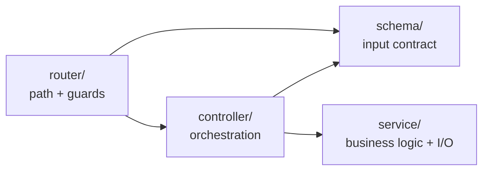

# 17 · Extending the Template

## The feature slice

Every feature in this codebase is the same four files:



| File                               | Owns                                                    |
| ---------------------------------- | ------------------------------------------------------- |
| `src/schema/<feature>.schema.ts`   | What the endpoint accepts, and the types                |
| `src/controller/<feature>.ts`      | Reading validated input, calling services, one response |
| `src/service/<feature>.service.ts` | Business logic and I/O — reusable, HTTP-unaware         |
| `src/router/<feature>.route.ts`    | Path, method, middleware chain                          |

`service/` does not exist yet — create it with your first real feature. Until
then, `email/` is the model for what a service looks like.

---

## Worked example: `POST /api/v0/products`

### 1. Schema

```ts
// src/schema/product.schema.ts
import { z } from 'zod';

export const createProductSchema = z.object({
    body: z.object({
        name: z.string().min(1).max(200).trim(),
        priceInCents: z.number().int().positive(),
        tags: z.array(z.string()).max(10).default([]),
    }),
});

export const listProductsSchema = z.object({
    query: z.object({
        page: z.coerce.number().int().positive().default(1),
        limit: z.coerce.number().int().positive().max(100).default(20),
    }),
});

export type createProductType = z.infer<typeof createProductSchema>;
export type listProductsType = z.infer<typeof listProductsSchema>;
```

Note `priceInCents`: integers avoid floating-point money bugs. And `.max(100)`
on `limit` — every bound is a denial-of-service you did not ship.

### 2. Service

```ts
// src/service/product.service.ts
import { db } from '@/config/database';

export interface CreateProductInput {
    name: string;
    priceInCents: number;
    tags: string[];
}

export const createProduct = async (input: CreateProductInput) => db.products.insert(input);

export const listProducts = async ({ page, limit }: { page: number; limit: number }) => {
    const [items, total] = await Promise.all([db.products.find({ skip: (page - 1) * limit, take: limit }), db.products.count()]);

    return { items, total, page, pages: Math.ceil(total / limit) };
};
```

The service knows nothing about HTTP — no `req`, no `res`, no status codes. That
is what makes it callable from a queue worker, a CLI script or a test.

### 3. Controller

```ts
// src/controller/product.ts
import { Request, Response } from 'express';

import asyncCatch from '@/error/asyncCatch';
import { createProductType, listProductsType } from '@/schema/product.schema';
import * as productService from '@/service/product.service';
import { customSuccessResponse } from '@/utils/customSuccessResponse';

export const create = asyncCatch(async (req: Request<{}, {}, createProductType['body'], {}>, res: Response) => {
    const product = await productService.createProduct(req.body);
    customSuccessResponse(res, 201, req.t('product_created'), product);
});

export const list = asyncCatch(async (req: Request<{}, {}, {}, listProductsType['query']>, res: Response) => {
    const result = await productService.listProducts(req.query);
    customSuccessResponse(res, 200, req.t('products_listed'), result);
});
```

Thin by design: validated input in, service call, one response out.

### 4. Router

```ts
// src/router/product.route.ts
import { Router } from 'express';

import { create, list } from '@/controller/product';
import validateSchema from '@/middleware/schema.validation';
import { verifyApiKey } from '@/middleware/verifyApiKey';
import { createProductSchema, listProductsSchema } from '@/schema/product.schema';

const productRouter = Router();

productRouter.get('/', validateSchema(listProductsSchema), list);
productRouter.post('/', verifyApiKey, validateSchema(createProductSchema), create);

export { productRouter };
```

### 5. Mount and translate

```ts
// src/router/index.ts
router.use('/products', productRouter);
```

```json
// locales/en/translation.json  (and every other language)
{ "product_created": "Product created", "products_listed": "Products listed" }
```

### Checklist

- [ ] Schema validates body/query/params and exports inferred types
- [ ] Service is HTTP-agnostic
- [ ] Controller is wrapped in `asyncCatch` and responds exactly once
- [ ] Router mounted in `src/router/index.ts`
- [ ] Translation keys added to **every** locale
- [ ] Sensitive routes guarded (`verifyApiKey`, or real auth)

---

## Adding a database

**1. Configuration** — `src/schema/env.schema.ts`:

```ts
database: z.object({
    DATABASE_URL: z.string().url(),
    DATABASE_POOL_SIZE: z.string().optional().default('10').transform(Number),
}),
```

Wire it in `src/config/env.ts` and document it in `.env.example`.

**2. Connection** — `src/config/database.ts`, exporting the client plus
`connectDatabase()` and `disconnectDatabase()`.

**3. Connect before listening** — `src/server.ts`:

```ts
await i18nReady;
await connectDatabase();     // fail fast: do not accept traffic without a database
const server = app.listen(…);
```

**4. Disconnect on shutdown**, inside `server.close(async () => { … })`.

**5. Readiness probe** that actually pings the database — see
[11-observability.md](11-observability.md#liveness-vs-readiness).

**6. Normalise driver errors** in `apiErrorHandler`'s `normalize()`, so a unique
constraint violation becomes a 409 rather than a 500.

| Choice     | Fits                                     |
| ---------- | ---------------------------------------- |
| Prisma     | Type-safe, great DX, migrations included |
| Drizzle    | SQL-first, lighter, excellent types      |
| Mongoose   | MongoDB                                  |
| AWS SDK v3 | DynamoDB                                 |

Migrations belong in versioned files, run in CI or a deploy step — never hand-run
SQL in production.

---

## Adding authentication

The template has an API key, which authenticates an **application**, not a
**user**. For per-user auth:

```
src/schema/auth.schema.ts        signup/login contracts
src/service/auth.service.ts      hashing, token issue/verify
src/controller/auth.ts           signup, login, refresh, logout
src/router/auth.route.ts         POST /auth/signup, /auth/login, …
src/middleware/authenticate.ts   verify token → req.user
src/middleware/authorize.ts      role / ownership checks
src/types/types.d.ts             declare `user?: AuthUser` on Request
```

```ts
// src/middleware/authenticate.ts
export const authenticate = asyncCatch(async (req, _res, next) => {
    const [scheme, token] = (req.headers.authorization ?? '').split(' ');

    if (scheme !== 'Bearer' || !token) {
        throw new ApiError(STATUS_CODES.UNAUTHORIZED, ERROR_CODES.UNAUTHORIZED,
            req.t('token_required', { ns: 'auth' }), …);
    }

    req.user = await verifyAccessToken(token);
    next();
});
```

Non-negotiables:

- **Hash with argon2 or bcrypt** (cost ≥ 12). Never store, log or email a
  password.
- **Short-lived access tokens** (15 min) + refresh tokens you can revoke.
- **Rate limit auth routes hard** — 5 attempts per 15 minutes.
- **Identical responses** for "wrong password" and "no such user", or you have
  built an account-enumeration API.
- **Authorization is separate from authentication.** "Who are you?" and "may you
  do this?" are different questions; checking only the first is
  OWASP API1, the most common serious API vulnerability.

```ts
// authorization belongs with the data, where ownership is known
const order = await orderService.findById(id);
if (order.userId !== req.user.id) throw new ApiError(STATUS_CODES.FORBIDDEN, ERROR_CODES.FORBIDDEN, …);
```

The `auth` translation namespace already exists for these messages.

---

## Adding tests

No test framework ships with the template. [Vitest](https://vitest.dev) fits
best — fast, TypeScript-native, Jest-compatible API.

```bash
npm i -D vitest supertest @types/supertest
```

```ts
// vitest.config.ts
import { defineConfig } from 'vitest/config';
import path from 'path';

export default defineConfig({
    test: { environment: 'node', globals: true },
    resolve: { alias: { '@': path.resolve(__dirname, './src') } },
});
```

```ts
// src/middleware/__tests__/schema.validation.test.ts
import request from 'supertest';
import app from '@/app';

describe('POST /api/v0/example/send-email', () => {
    it('rejects an invalid email with E006', async () => {
        const res = await request(app).post('/api/v0/example/send-email').send({ to: 'nope' });

        expect(res.status).toBe(400);
        expect(res.body.error.code).toBe('E006');
        expect(res.body.error.details).toContain('body.to');
    });
});
```

`app.ts` and `server.ts` are separate precisely so a test can import the app
without binding a port.

What is worth testing first, in order: validation schemas (pure, fast, high
value), the error handler's normalisation, middleware behaviour (auth, limits),
then endpoints end-to-end with supertest. Mock the boundary — SendGrid, the
database — not your own code.

Then add to CI:

```yaml
- run: npm test
```

---

## Adding background jobs

Anything slow, retryable, or not needed for the response belongs off the request
path: emails, reports, webhooks, image processing.

```
src/queue/connection.ts    Redis/SQS client
src/queue/<name>.queue.ts  producer
src/worker/<name>.worker.ts consumer
src/worker/index.ts        worker entry point (a second process)
```

[BullMQ](https://docs.bullmq.io) (Redis) or SQS both work. Run the worker as its
own process — `pm2 start build/worker/index.js` — so a slow job cannot affect API
latency. Give every job **retries with backoff** and a **dead-letter queue**; a
job that fails silently is worse than one that fails loudly.

---

## Adding a third-party integration

Follow the shape of `src/email/`:

1. One module that owns the SDK — nothing else imports it
2. Config validated in the env schema, optional if the app works without it
3. Wrap every provider error in an `ApiError`; log the original, return generic
4. Set timeouts, and decide what happens when the provider is down
5. Never let a provider's error message reach the client — it may contain keys

That boundary is what makes the provider swappable: replacing SendGrid with SES
means rewriting one function, and no controller changes.
